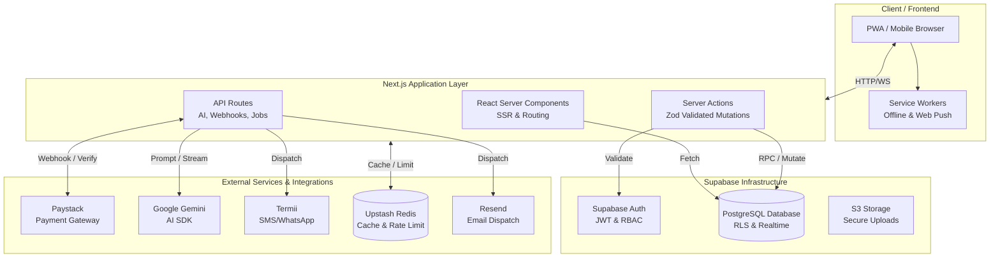

<div align="center">
  
  <h1>OurMenu OS</h1>
  <p><strong>The Universal Digital Operating Layer for Modern Businesses</strong></p>
</div>

---

OurMenu OS is a comprehensive, enterprise-grade SaaS platform engineered to power the customer-facing digital presence of dynamic businesses. It is a highly scalable, multi-tenant operating layer serving retail boutiques, service professionals, spas, consultants, and real estate agencies.

By deploying dynamic, template-driven digital environments reachable via custom QR codes or direct links, businesses completely bypass the friction of native app downloads. OurMenu OS delivers real-time catalogs, interactive service bookings, intelligent digital rate cards, and a seamless omnichannel checkout experience—instantly, right in the browser.

---

## 🎯 Product Thesis

**Do not build another static site generator. Do not build another PDF QR menu.** 
Build the live, intelligent, and deeply integrated operating layer for what customers can see, buy, request, book, and trust *right now*.

---

## 🏗️ World-Class Architecture & Enterprise Security

OurMenu OS is engineered for massive scale, zero downtime, and bank-grade security. It passes the strictest enterprise audits out-of-the-box:



- **Impenetrable API Boundaries (Zod):** Every single Server Action and API route is rigorously validated via strict `zod` schema typing. It is mathematically impossible for malformed payloads to reach the database layer.
- **Absolute IDOR Protection:** Deep relational authorization matrices ensure that hardware provisioning (QR mapping), location configurations, and page builder tools are cryptographically isolated. A malicious actor cannot modify or access data belonging to another tenant or location.
- **Flawless React SSR Hydration:** Utilizing advanced Zustand `skipHydration: true` middleware synchronized perfectly with React lifecycle hooks, the platform guarantees zero UI flashing, layout shifts, or Server-Side Rendering (SSR) mismatches between the Edge server and the client browser.
- **XSS & HTML-Injection Hardened:** All user-generated content passing through email notifications, push payloads, and template rendering is aggressively escaped, sanitized, and type-checked.
- **N+1 Query Elimination & Infinite Scale:** Core notification and dispatcher systems utilize highly parallelized `Promise.all` fetching strategies. Meanwhile, data-heavy dashboards (like CRM and Order History) employ strict **cursor-based pagination**, bypassing Vercel/Serverless timeout constraints and guaranteeing instant execution whether an organization has 5 records or 5,000,000.
- **GDPR-Compliant Marketing Queues:** Enforced opt-in filtering for customer marketing communications, paired with background queues for bulk email dispatches to eliminate 504 timeouts at scale.
- **Storage Protection & Secure Uploads (Denial of Wallet Defense):** Cloud storage buckets are exclusively mutated via secure server-side routes leveraging `createAdminClient`, entirely eliminating insecure public Row Level Security (RLS) policies. Furthermore, buckets are natively locked to strict file sizes (e.g. 5MB) and MIME-type whitelists (WebP, PNG, JPEG) to prevent malicious bulk uploads and SDK exploitation.
- **WCAG 2.1 Accessibility Compliance:** The platform delivers premium mobile UI flows with fluid focus trapping, strict ARIA attribute integrations (`aria-expanded`, `aria-controls`, `role="dialog"`), and seamless screen-reader support.

---

## 🏬 Multi-Business Universal Templates

OurMenu OS is fundamentally decoupled from the concept of a "restaurant." It is a true multi-business platform, dynamically rendering the correct UI based on the active **Template Builder**:

1. **Hospitality (The Core):** Live restaurant menus, bar bottle service, dynamic cafe sell-out tracking, and food trucks.
2. **Retail & Boutiques (Catalog Template):** Tech gadget shops, fashion boutiques, pharmacies, and local stores requiring a highly visual storefront, inventory management, and instant checkout.
3. **Services (Booking Template):** Salons, spas, therapists, and tutors who need to showcase services, handle complex appointment slots, and collect upfront deposits.
4. **Consultants & Agencies (Rate Card & Quote Templates):** Freelancers, marketing agencies, and consultants deploying polished, interactive digital rate cards for standardized B2B pricing, alongside dynamic Quote Generator templates.
5. **Real Estate & Automotive (Listings Template):** Property rentals, car dealerships, and equipment rentals requiring image-heavy, location-based galleries.
6. **Portal Mode:** A dynamic macro-landing page that seamlessly routes customers to multiple specialized sub-pages (e.g., A massive Hotel routing guests to a Restaurant menu, a Spa booking page, and a Room Service catalog from a single QR scan).
7. **Custom Layout Builder & Per-Page Theming:** An advanced, block-based page builder allowing organizations to create completely bespoke digital environments. Features granular per-page aesthetic overrides, allowing unique background and accent colors that gracefully fall back to the brand default.

---

## 🚀 Core Features & Engines

### 1. The Omnichannel Checkout & Monetization Engine
A resilient, globally aware checkout engine powers the entire ecosystem:
- **Paystack Native Integration:** Seamlessly handles split payments, automated service charges, and real-time reconciliation via cryptographic Webhooks.
- **Automated SaaS Ledger (Platform Fees):** A transparent, built-in ledger system that extracts a configurable SaaS platform fee (e.g., 2%) on every transaction, driving pure MRR beyond monthly subscriptions.
- **SaaS Lifecycle & Automated Billing Emails:** Integrated automated email sequences (powered by Resend and Vercel Cron) to handle Trial Expirations, Subscription Activations, and precise Invoicing without requiring external CRM orchestration.
- **Enterprise Tax & Compliance Engine:** Dynamically calculates localized taxes (e.g., VAT, State Taxes) and applies them accurately before reaching the payment gateway, providing transparent itemized receipts for strict global compliance.
- **Coupon & Discounts Manager:** A robust system allowing admins to distribute customizable coupons for free trials, free plans, credit extensions, or plan extensions to aggressively drive B2B acquisition and retention.
- **Global Manual Fallback:** If API keys are pending or the payment provider experiences regional downtime, the system automatically degrades to a localized "Manual Bank Transfer" workflow, ensuring conversions are never blocked.
- **Omnichannel Logistics & Per-Page Routing:** Full, robust support for Dine-in (Table-specific QR mapping), Pickup, and Delivery (with interactive delivery zones, SMS phone verification, and dynamic fees). Fulfillment logic is highly granular, allowing **per-page configuration** (e.g., a "Room Service" page forces table delivery, while a "Lobby Cafe" page allows pickup).

### 2. Live Fulfillment Dashboard & Workstation Routing
Re-architected to serve any industry, the operations center is a real-time, WebSocket-powered hub:
- **Universal Tracking:** Tracks incoming restaurant orders, spa booking requests, and retail pickup orders simultaneously.
- **Dynamic Workstation Routing:** Orders are intelligently fragmented and routed to specific departments (e.g., *Grill*, *Tailoring*, *Bar*). Workstations can filter the board to only see the partial tickets relevant to them, ensuring extreme operational efficiency.
- **Fulfillment Kanban Hub:** A dedicated drag-and-drop Kanban dashboard specifically built to supervise dispatch operations, seamlessly moving orders through generic states (*To Do* ➔ *In Progress* ➔ *Completed*).
- **Advanced Triaging & Deep Search:** Instantly filters active states, calculates prep times, and supports deep-searching globally by Table ID, Order ID, and specific item names.

### 3. PWA & True Native App Experience
OurMenu OS feels indistinguishable from a native iOS/Android application:
- **Service Workers:** Caching assets for offline resilience and near-instant load times (via `next-pwa`).
- **Web Push Notifications:** Deeply integrated Web Push API ensures businesses receive instant, native alerts (with sounds) on their devices the second a new order or booking is placed.
- **Bulletproof International Messaging:** Integrated Termii API for automated fallback WhatsApp and SMS notifications, backed by aggressive Regex parsing to seamlessly handle global phone formats (e.g., `+1 (415)...` or `0803...`).
- **Premium Fluid Aesthetics:** Global integration of `framer-motion` guarantees 60fps spring-physics animations, staggered layout reveals, and frosted-glass micro-interactions.

### 4. Enterprise Fleet & Location Management
Seamlessly scale operations across multiple venues, cities, or countries from a single organization:
- **Dynamic Branch Switcher:** A unified dashboard allowing owners to instantly swap active branch contexts.
- **Decoupled Hardware Provisioning & Smart Routing:** Print thousands of generic "dummy" QR codes in bulk, deploy them globally, and securely re-map them remotely. QR codes can be dynamically routed to specific location pages (e.g. routing directly to a "Room Service" sub-page or "Spa Bookings") from the dashboard without ever reprinting physical assets.
- **Scoped Data Views:** Operations, Menu Managers, and Analytics dashboards automatically and securely filter down to the active location context via encrypted cookies.

### 5. AI-Powered Operations (Copilot & Agents)
- **Admin AI Copilot with RBAC:** A deeply integrated, conversational assistant built directly into the merchant dashboard. The Copilot possesses profound domain knowledge of OurMenuOS and enforces strict **Role-Based Access Control (RBAC)**. It can autonomously execute dashboard actions—like dynamically creating menu categories or adding items via AI SDK Tools—while blocking unauthorized staff from accessing financial reports.
- **Fail-Safe AI Architecture:** All Vercel AI SDK integrations (`generateObject`, `generateText`, `streamText`) are wrapped in rigorous exception handlers. AI provider timeouts, overloads, or hallucinations are gracefully caught and mapped to `503 Service Unavailable`, guaranteeing the edge functions never silently crash.
- **Voice Dictation & Hands-Free UI:** Customers can use natural voice dictation via the Web Speech API to interact with the AI, enabling a fully seamless two-way conversational back-and-forth. The AI autonomously manages their shopping cart (add/remove) and calls staff directly via AI tool execution.
- **Multimodal Menu Importer:** Powered by Gemini 3.5 Vision, physical menus can be photographed and instantly parsed into structured digital catalogs with superior spatial understanding, replacing legacy OCR techniques.
- **Structured AI Rules Engine:** Configure strict guardrails including Base Personalities (Professional, Casual, Witty), Escalation Contacts, and a dynamic JSON-based FAQ builder that seamlessly injects venue-specific context directly into the system prompt.
- **AI Copywriter & Image Studio:** Generative AI deeply integrated into the Page Builder, assisting businesses in writing high-converting item descriptions and generating stunning, professional cover images on the fly.
- **AI Demand Forecasting (`/api/ai/forecast`):** Analyzes 30-day sales velocity and utilizes Google Gemini to predict 7-day demand trajectories, issuing smart inventory alerts (Critical, Order Soon, Sufficient).
- **Smart Upselling Engine (`/api/upsell`):** Intelligent checkout add-on engine dynamically analyzes cart contents to suggest highly relevant cross-sells, maximizing Average Order Value (AOV).

### 6. Superadmin Developer Console
A powerful, centralized control panel allowing platform owners to dictate global configurations without touching code or running SQL queries:
- **Real-Time Global Configuration:** Instantly modify SaaS subscription pricing, platform fee percentages, and default trial periods dynamically.
- **Customizable AI Credit Economics:** Dynamically adjust the exact credit cost (e.g., 1 credit, 3 credits) for individual AI actions across the platform, including Demand Forecasting, Auto-Fill, and Image Generation.
- **Global Manual Fallback Overrides:** Instantly enforce a global bypass of the payment provider (Paystack) during regional downtimes, forcing all checkouts to use manual bank transfers.
- **Tenant Directory & Hackathon Exports:** A bird's-eye view of all registered businesses with instant CSV generation for hackathon or investor metrics.

### 7. CRM, Loyalty & Gamification
- **Customer Profiles & LTV:** Automatically builds rich CRM profiles at checkout, seamlessly syncing critical data like phone numbers across orders, and tracking Lifetime Value (LTV), order frequency, and marketing opt-ins.
- **Bespoke Loyalty Programs:** Organizations can launch custom point-based reward systems, configurable down to the fractional currency unit.
- **Payment Roulette & Bill Splitting:** A gamified "spin to win" bill-splitting randomizer that transforms the friction of group payments into a highly engaging, viral experience. 
- **PIN-Protected Post-Service Feedback:** Automated email receipts include a cryptographic 4-digit PIN ensuring only verified customers can rate staff performance, populating the gamified Team Performance Leaderboard and the centralized **Feedback Inbox** within the dashboard.

### 8. Global SEO, AEO & Privacy Compliance
- **Dynamic Semantic JSON-LD:** Intelligent generation of `LocalBusiness`, `ItemList`, and `Product` schemas tailored for each specific business and catalog, boosting local SEO visibility.
- **Answer Engine Optimization (AEO):** Screen-reader-only descriptive blocks feed AI tools (ChatGPT, Perplexity) context around business identities. 
- **Privacy-First Indexing:** A strict opt-in framework controls web crawlers. All tenant directories default to `noindex, nofollow` to protect private menus, only enabling public indexing when the tenant explicitly grants consent via the compliance dashboard.

### 9. Inventory Manager & Component Breakdown (BOM)
A purpose-built, real-time stock management system designed for any physical business — roadside grills, cafes, retail stores, salons — that needs to track tangible assets without a complex ERP:
- **Live Item Ledger:** Every item has a running quantity, category, unit, SKU, optional cost price, reorder threshold, and notes. Items are per-location, so multi-branch orgs stay fully isolated.
- **Component Breakdown (BOM) Engine:** Dynamically map catalogue products to required raw materials (e.g. a "Burger" requires 1 "Bun" and 1 "Patty"). When a product is sold, the system atomically calculates historical **Cost of Goods Sold (COGS)** and deducts the exact ingredient quantities from the ledger.
- **5 Movement Types:** `Restock`, `Use`, `Wastage/Loss`, `Sale`, and `Manual Adjustment` — each with an optional note for accountability.
- **Signed Quantity Trigger:** A Postgres trigger (`sync_inventory_quantity`) atomically applies every movement to the item's `current_quantity`, making the ledger race-condition-safe.
- **Stock Status Alerts:** Items automatically surface as *In Stock*, *Low Stock* (approaching the reorder threshold), or *Out of Stock* with distinct colour-coded visual states.
- **Quick-Log Dialog:** Staff tap a single button on any item to open a fast-entry modal — select movement type, enter quantity, optionally add a note. Outbound movements block submission if stock would go negative.
- **Movement Log Tab:** A full chronological audit log of every stock event across the location — filterable and reverse-sorted by time.
- **Stats Row:** At-a-glance totals for Total Items, Low Stock count, and Out-of-Stock count with clickable filter shortcuts.

### 10. Order Cancellation & Smart Sell-Out Engine
- **Atomic Sell-Out Tracking:** Items can optionally track finite units via race-condition-free database RPCs, automatically switching to *Sold Out* when availability reaches zero.
- **Order Cancellation Lifecycle:** Businesses can safely reject orders with a logged reason for analytics, with the option to instantly restock rejected inventory.
- **Optimistic UI Validation:** Waitstaff can modify stock limits dynamically from the dashboard without page refreshes.

### 11. Customer IOU & Store Credit System
- **B2B & B2C Credit Management:** Organizations can manually approve trusted customers for a "Buy Now, Pay Later" (IOU) tab, complete with dynamic credit limits and auto-approval thresholds based on historical spend.
- **Omnichannel Credit Checkout:** Integrated directly into the guest checkout flow, allowing approved customers to bypass card/cash payments and deduct instantly from their Store Credit balance.
- **Automated IOU Reminder Engine:** Vercel Cron orchestrator intelligently identifies customers whose balance exceeds organization thresholds and automatically dispatches rich HTML emails with direct payment links, enforcing minimum repayment percentages.
- **Storefront Payment Portal:** A frictionless, no-login portal (`/m/[slug]/iou/[customerId]`) where customers can seamlessly clear partial or full debt balances directly via Paystack, triggering real-time webhook reconciliation against their credit limit.

### 12. Enterprise Team & Intercom Orchestration
- **Department-Based Routing & Roles:** Organizations can group staff into bespoke departments (e.g., *Kitchen*, *Concierge*, *Housekeeping*). The platform natively provisions strict Row Level Security (RLS) to isolate staff members to their designated domains.
- **Realtime Internal Chat:** A floating, globally accessible communication widget for staff to coordinate in real-time, featuring dedicated channels per department.
- **Managerial Oversight:** Owners and Managers automatically inherit read/write bypasses allowing them to oversee and communicate across all departmental channels simultaneously.
- **Rich Media & WebSocket Synchronization:** Powered by Supabase Realtime subscriptions, ensuring messages (text, voice notes, cloud-backed images) instantly propagate across all active staff dashboard sessions.

### 13. Back-of-House Operations Engine
OurMenu OS is a true operating system, extending far beyond the customer-facing frontend into deep backend workflows:
- **Demo Mode Bypass:** A dedicated `?demo=1` architectural flow allowing prospective users to experience the full dashboard, analytics, and CRM mock data without creating an account.
- **Master Cron Orchestrator:** Designed to bypass Vercel Hobby tier limitations by orchestrating multiple background jobs (Daily Reports, IOU Reminders, Abandoned Carts) within unified daily execution slots.
- **Automated Daily Reports:** Nightly cron jobs that aggregate key business metrics (sales, velocity, feedback) and email summarized briefings directly to owners.
- **Quotes Engine:** A dedicated pipeline for consultants, freelancers, and agencies to track, manage, and respond to custom B2B rate inquiries instantly.
- **Properties & Shifts Management:** Dedicated infrastructure for scheduling staff shifts and managing complex real estate and lodging templates.
- **Developer Console & Metrics Export:** Deep administrative tooling allowing platform owners to export cross-organizational analytics (e.g., Hackathon metrics, platform-wide sales volume) instantly.


---

## 💳 Pricing & Feature Tiers

OurMenu OS monetizes via three tiered subscription plans, driven by a unified credit system that seamlessly up-sells usage into Pro and Enterprise tiers.

### 🟢 Lite Plan (₦19,999 / month)
*Perfect for testing the system at a single venue.*
- **Credits:** 10 Monthly Credits
- **Locations:** 1 active location
- **QR Codes:** Up to 2 active QR codes/tables
- **AI Assistant:** Customizable, domain-specific AI Assistant (guest-facing chat)
- **Edge Translator:** Real-time menu translation for 40+ languages

### 🔵 Pro Plan (₦69,000 / month)
*For serious operators who want every edge.*
- **Credits:** 50 Monthly Credits (Refreshes every month)
- **Locations:** 1 active location
- **QR Codes:** Unlimited QR codes/tables
- **Premium AI Tools:** AI Copywriter & AI Image Studio
- **Operations:** Live Fulfillment Dashboard & Smart Request Triaging
- **Forecasting:** AI-driven inventory and sales forecasting engine
- **Custom Pages:** 1 Page included (Additional pages cost 10 Credits each)

### 🟣 Enterprise Plan (Custom Pricing)
*For massive chains and multi-location brands.*
- **Credits:** 200 Monthly Credits
- **Locations:** Multi-location dashboard (Manage multiple venues under one org)
- **Features included:** All premium AI tools, unlimited hardware provisioning, custom portals.
- **Integrations:** Direct API access for PMS (Property Management System) integration.

### Phase 3: Visual Resource Manager
- **Status:** **Completed**
- **Core Additions:**
  - `public.resources` table for defining tables, rooms, and bays.
  - UI grid grouping resources by logical Zones (e.g., "Main Floor").
  - Order payloads now map directly to `resource_id` instead of raw strings.
  - Generates instant QR codes that point to `?resource=[UUID]` for airtight cart tracking.
  - Full mobile responsiveness utilizing modern flex/grid and micro-animations.

---

### 🤝 Affiliate & Referral System (B2B Growth)
OurMenu OS features a built-in Affiliate system designed for aggressive B2B scaling:
- **Affiliate Dashboard:** Partners register to generate unique referral codes.
- **Hard-Linked Organizations:** New tenants that register via referral links are permanently cryptographically tied to their affiliate.
- **Automated Rev-Share:** Automated Webhooks calculate a 10% commission on every single subscription renewal and log it directly in `affiliate_earnings` for instant payout.

---

## 🛠️ Tech Stack & Repo Layout

- **Framework:** Next.js 16 (App Router, Server Actions, async `params`)
- **Database & Auth:** Supabase (PostgreSQL, Row Level Security, Edge Functions)
- **State Management:** Zustand (with fully synchronized SSR hydration middleware)
- **Validation & Security:** Zod (Strict, impenetrable API boundaries)
- **AI Engine:** Google AI SDK (`@ai-sdk/google`) + Gemini 3.5 Flash (Vision & Text)
- **Caching & Rate Limiting:** Upstash Redis (`@upstash/redis`, `@upstash/ratelimit`)
- **Error Tracking & Observability:** Sentry (`@sentry/nextjs`)
- **End-to-End Testing:** Playwright (`@playwright/test`)
- **Styling & Animation:** Tailwind CSS v4 + Framer Motion
- **Payments & Comms:** Paystack (Webhooks), Termii (WhatsApp/SMS), Web Push API

### Repo Structure
- `docs/PRODUCT_PLAN.md`: working product plan, viability audit, roadmap, and assumptions.
- `app/`: Next.js 16 application containing the customer-facing SaaS dashboard and public progressive web app (PWA).
- `components/`: shared UI components, Layouts, and standard views.
- `lib/`: shared domain models, business logic, payments, and AI integrations.
- `supabase/migrations/`: production database schema migrations.
- `supabase/functions/`: edge functions (webhooks, push notifications, reconciliations).

---

## 💻 Running the Application Locally

### 1. Web Application (Next.js)
```bash
pnpm install
pnpm dev
```
Open https://ourmenuos.online to access the dashboard.

### 2. Supabase Edge Functions
To test Webhooks or Push Notifications locally, install the Supabase CLI:
```bash
# Start the local supabase instance
supabase start

# Serve the edge functions locally
supabase functions serve
```
*Note: Ensure your `.env.local` is populated with the appropriate Supabase anon keys, service roles, and VAPID keys for the web push system.*
