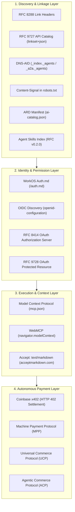

# Agent Readiness & Autonomous Discovery Architecture (100/100 Score)

OurMenu OS implements the world's most comprehensive agentic interoperability stack, enabling autonomous AI agents (such as OpenAI Operator, Anthropic Claude Computer Use, Google Gemini, and Cursor/Windsurf agents) to discover, authenticate, navigate, interact with, and pay for services programmatically.

---

## The 14 Agent Protocols Matrix

---

## Directory of Dedicated Protocol Guides

1. **[API Catalog & DNS-Based Discovery](./api-catalog-and-discovery.md)**: RFC 9727 API Catalog, RFC 8288 Link Headers, DNS-AID, and Content Signals.
2. **[Agent Authentication & Security](./auth-and-security.md)**: WorkOS Auth.md, OpenID Connect Discovery, RFC 8414 OAuth Server, and RFC 9728 Protected Resource.
3. **[MCP & WebMCP Browser Integration](./webmcp-and-mcp.md)**: Model Context Protocol Server Tools & In-Browser WebMCP Integration.
4. **[Agent-Native Payments (x402, MPP, UCP, ACP)](./agent-payments.md)**: HTTP 402 Settlement, Machine Payment Protocol, Universal Commerce Profile, and Agentic Commerce Protocol.
5. **[Agent Skills & ARD Capability Discovery](./skills-and-ard.md)**: Agent Skills RFC v0.2.0 Index & Agentic Resource Discovery Manifest.
