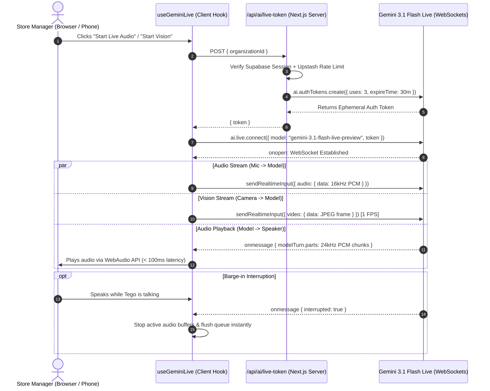

# AI-Native Operations & Tool Calls

OurMenu OS is structurally designed to be run *by* AI. We do not use AI as a novelty chatbot; it is deeply embedded into the operational workflows of both the merchant and the consumer.

---

## 1. Dual AI Engine Architecture

```mermaid
flowchart TD
    subgraph AdminLayer ["Merchant Operations Layer"]
        Merchant(["Merchant / Store Manager"]) -->|"Voice (16k/24k PCM) / Camera Stream"| GeminiLive["Tego Multimodal Live (Gemini 3.1 Flash Live)"]
        Merchant -->|"Text Chat Co-Pilot"| AdminCopilot["Admin AI Co-Pilot (/api/ai/copilot)"]
        GeminiLive & AdminCopilot --> AdminTools["Admin Tool Execution"]
        AdminTools --> T1["update_brand_appearance"]
        AdminTools --> T2["get_business_structure"]
        AdminTools --> T3["get_recent_orders"]
        AdminTools --> T4["create_fleet_location"]
        AdminTools --> T5["duplicate_page_catalog"]
    end

    subgraph PublicLayer ["Customer Frontline Layer"]
        Customer(["Guest / Customer (/m/:slug)"]) -->|"Text / Voice Inquiry"| PublicChat["Frontline Public Tego (/api/chat)"]
        PublicChat --> GroundingCheck{"Grounded in DB?"}
        GroundingCheck -->|"Yes (Menu/FAQ/Hours)"| PublicTools["Autonomous Tool Calling (Cart/Booking/Dietary)"]
        GroundingCheck -->|"No / Escalation Needed"| ServiceReq[("service_requests (Supabase Realtime)")]
        ServiceReq -->|"Instant WebSocket Push"| StaffDashboard["Orders Dashboard (Sound Chime)"]
    end

    style AdminLayer fill:#0f172a,stroke:#3b82f6,stroke-width:2px,color:#fff
    style PublicLayer fill:#1e1b4b,stroke:#818cf8,stroke-width:2px,color:#fff
    style GeminiLive fill:#064e3b,stroke:#34d399,stroke-width:2px,color:#fff
    style PublicChat fill:#78350f,stroke:#fbbf24,stroke-width:2px,color:#fff
    style StaffDashboard fill:#065f46,stroke:#10b981,stroke-width:2px,color:#fff
```

---

## 2. Real-Time Multimodal Live API (Voice & Vision)

---

## 3. The Business AI (Tego Admin Co-Pilot)

A deeply integrated assistant built directly into the merchant dashboard with **Gemini Multimodal Live API (`gemini-3.1-flash-live-preview`)** integration.

- **Real-Time Voice & Vision**: Real-time 16kHz audio streaming with 24kHz playback and instant barge-in interruption. Continuous 1 FPS camera video ingestion allows merchants to show dishes, inventory shelves, paper invoices, or handwritten notes directly to Tego.
- **Autonomous Tool Calls**: The AI can execute `create_fleet_location` (launch physical branches), `duplicate_page_catalog` (1-click catalog duplication across branches), `update_brand_appearance` (mutating global or per-page design tokens), `get_business_structure`, and `get_recent_orders`.
- **Deep Technical RAG (`query_os_documentation`)**: Real-time retrieval over `/llms-full.txt` allowing Tego to explain any deep feature (Webhooks, CRM, Delivery, POS, Multi-Gateways) accurately.
- **Data Protection**: The Copilot strictly evaluates the user's RBAC scope (Owner, Manager, Staff, Viewer).

---

## 4. The Frontline Public Assistant (`/api/chat`)

The customer-facing AI removes browsing friction across restaurant menus, retail catalogs, booking pages, and rate cards.

- **Adaptive Identity**: Defaults to `"Tego • {businessName}"` (or custom name configured in `locations.ai_name`).
- **Domain Personas**: Adapts role, subtitle, greeting, and 1-tap suggestion chips to the specific business vertical.
- **Cart & Order Mutation**: Autonomously executes `addToCart`, `removeFromCart`, `clearCart`, and `checkout`.
- **Dietary & Allergen Filtering**: Executes `searchByDietaryAllergen` to locate matching dishes for dietary preferences.
- **Zero-Hallucination Guardrails**: Strictly grounded in verified database facts. Never fabricates unlisted details; automatically escalates unknown inquiries to human staff.
- **Dashboard Human Handoff**: Escalates to `service_requests`, notifying floor staff via real-time WebSocket on `/dashboard/orders` with full customer context.

---

## 5. Generative Vision & Ingestion Pipelines

- **Multimodal Menu Importer (`/api/ai/parse-menu`)**: Powered by Gemini Vision. Physical menus can be photographed and instantly parsed into structured digital catalogs.
- **AI Copywriter & Image Studio**: Page Builder assistant for high-converting item descriptions and marketing copy.
