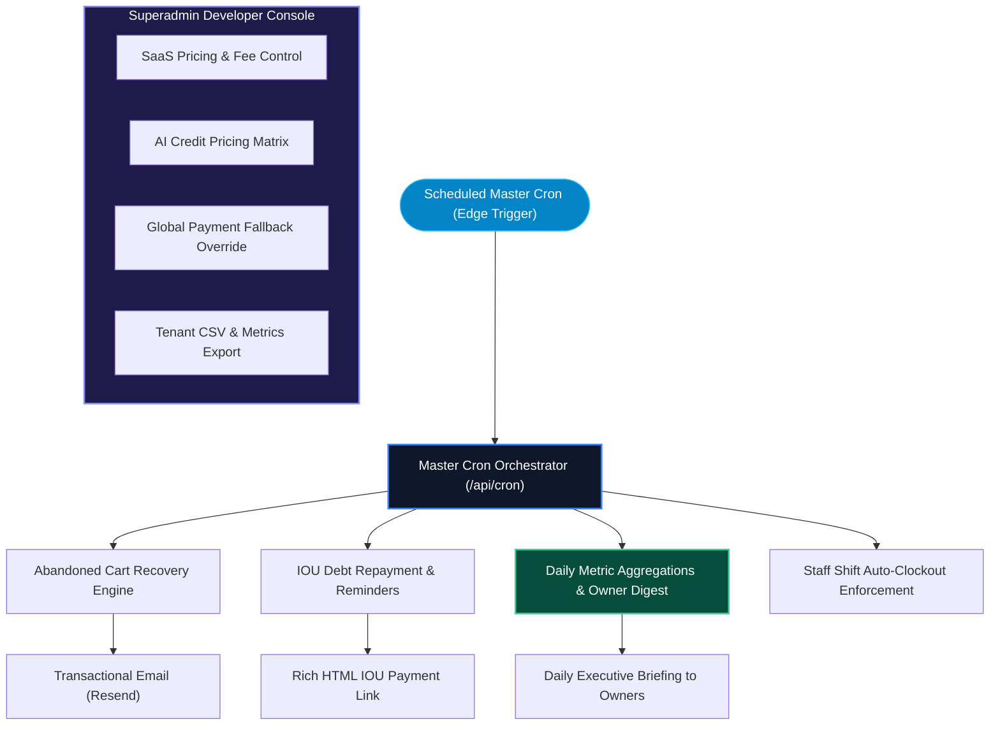

# Back-of-House Operations Engine

OurMenu OS extends far beyond the customer-facing frontend into deep backend workflows designed for enterprise administrators and platform owners.

---

## 1. Back-of-House Architecture & Cron Pipeline

---

## 2. Master Cron Orchestrator

We bypass serverless limits by orchestrating background jobs within unified, rate-limited execution slots:

- **Abandoned Carts:** Identifies stranded checkout sessions and triggers re-engagement reminders.
- **IOU Reminders:** Intelligently identifies customers whose Store Credit balance exceeds organization thresholds and automatically dispatches rich HTML emails with direct payment links, enforcing minimum repayment percentages.
- **Automated Daily Reports:** Nightly cron jobs aggregate key business metrics (sales, velocity, feedback) and email summarized briefings directly to location owners.
- **Shift Enforcement:** Auto-closes overdue shifts if staff forgot to clock out at the end of the day.

---

## 3. Developer Console & Platform Controls

Platform owners have access to a centralized Superadmin Developer Console:

- **Global Configuration:** Instantly modify SaaS subscription pricing, platform fee percentages, and default trial periods dynamically without running SQL migrations.
- **Customizable AI Credit Economics:** Dynamically adjust the exact credit cost (e.g., 1 credit, 3 credits) for individual AI actions across the platform, including Tego Live, Demand Forecasting, Auto-Fill, and Image Studio.
- **Global Manual Fallback Overrides:** Instantly enforce a global bypass of the payment provider during regional downtimes, forcing all checkouts to use manual bank transfers.
- **Tenant Directory & Exports:** A bird's-eye view of all registered businesses with instant CSV generation for metrics.

---

## 4. Demo Mode Bypass

A dedicated `?demo=1` architectural flow allowing prospective users and investors to experience the full dashboard, analytics, and CRM mock data without creating an account. It intercepts authentication proxy logic and mounts read-only synthetic state.

---

## 5. Quotes Engine

A dedicated CRM pipeline for consultants, freelancers, and agencies to track, manage, and respond to custom B2B rate inquiries instantly.
