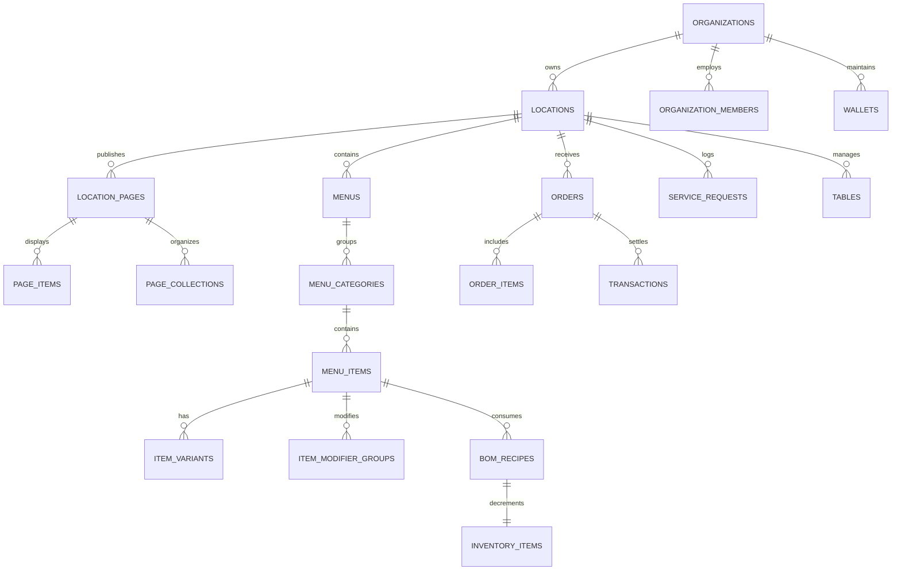

# Data Layer & Engine Architecture

OurMenu OS is not a static storefront—it is a deeply relational, multi-tenant Business Operating System. To achieve **Category Impact**, we discarded brittle JSON structures and legacy e-commerce flat tables, engineering a Universal Data Layer capable of scaling to thousands of parallel businesses.

---

## 1. Multi-Tenant Relational Schema

---

## 2. Universal Taxonomy Engine

Traditional platforms lock businesses into rigid categories (e.g., "Appetizers", "Mains"). OurMenu OS utilizes a strictly relational, infinite-depth `page_collections` tree.

- **Infinite Depth:** A boutique can nest `Winter 2026 -> Outerwear -> Coats`, while a salon simply uses `Hair -> Styling`.
- **Dynamic Routing:** Collections automatically generate SEO-optimized semantic JSON-LD, making the taxonomy natively readable by search engines and Answer Engine Optimization (AEO) crawlers.

---

## 3. Universal Search Engine (FTS)

With thousands of SKUs, standard `ILIKE` queries collapse under load. OurMenu OS harnesses native PostgreSQL **Full-Text Search (`tsvector`)** and **GIN indexes** across the unified `page_items` and `menu_items` layers.

- **Millisecond Latency:** Guarantees instant global searches across massive catalogs.
- **AI Copilot Disambiguation:** The search layer interfaces directly with the AI Copilot. When a user speaks a complex query via Voice Dictation ("Show me gluten-free vegan options under $20"), the AI translates the semantic intent into precise FTS parameters.

---

## 4. Polymorphic Orders Engine

We designed a checkout engine that fundamentally redefines transactions for multi-service businesses.

- **Unified Cart:** A customer can add a physical retail product (e.g., a bottle of wine) and a timezone-aware service booking (e.g., a 60-minute massage) into the exact same checkout cart.
- **Polymorphic Execution:** At checkout, the engine fragments the order. Retail items instantly deduct from the **BOM (Bill of Materials) Inventory Ledger** via race-condition-free RPCs. Service items lock time-slots in the **Deep Availability Engine**. Both are reconciled under a single transaction.

---

## 5. Business Viability: Automated SaaS Ledger

To guarantee sustainable revenue, the data layer natively incorporates a monetization engine:

- **Platform Fees:** A built-in ledger extracts a configurable SaaS platform fee (e.g., 2%) atomically on every transaction, driving pure Monthly Recurring Revenue (MRR) without relying solely on subscription renewals.
- **First-Party Ad Network:** Injects native advertisements directly into the taxonomy grid, tracking highly accurate `IntersectionObserver` impressions for passive B2B revenue.
