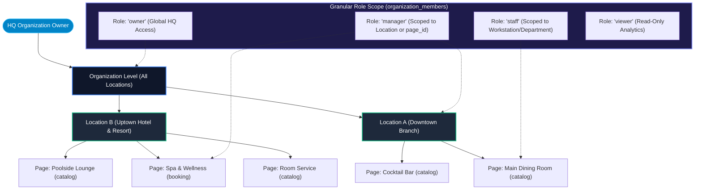

# Enterprise Fleet Management, Franchise Autonomy & RBAC

OurMenu OS provides intentional architectural boundaries for massive scale, allowing organizations to cleanly manage multiple venues, franchise branches, and isolated sub-businesses from a single pane of glass.

---

## 1. Fleet Hierarchy & Granular RBAC Architecture

---

## 2. Dynamic Branch Switcher & Franchise Mode

Organizations scaling across cities, countries, or franchise networks operate from a unified dashboard.

- **Franchise Mode (1-Click Duplication):** Businesses with multiple physical locations (or multi-venue franchises) can duplicate an existing branch (`location_pages`) instantly using `duplicatePageAction`. This recursively clones all `page_collections`, `page_items`, and their junction mappings (`page_item_collections`), giving the new branch an identical operational starting point while preserving absolute autonomy for future menu and price modifications.
- **Dynamic Switcher:** A dynamic branch switcher instantly swaps the active context, routing all subsequent API calls to the chosen location.

---

## 3. Independent Sub-Businesses & Location Autonomy (`location_pages`)

We built the `location_pages` architecture to solve both the **Hotel Problem** (distinct venues like Spa, Restaurant, and Lobby Cafe within one property) and the **Franchise Problem** (same brand across multiple physical branches).

- **Absolute Isolation:** Each sub-page can override the parent organization's settings. A Spa or a remote branch can have custom Wi-Fi credentials, operating hours, contact numbers, and AI Chat Assistant rules entirely separate from the main HQ.
- **Tiered Manager System & Granular RBAC:** Using the optional `page_id` column on `organization_members` and `organization_invites`, staff members and branch managers can be cryptographically scoped to specific `page_id`s. A franchise branch manager can log into the dashboard and *only* view, edit, or manage staff and bookings for their assigned branch, reporting up to HQ Owners/General Managers without cross-branch interference.

---

## 4. Business Protection: Fired Staff & Replaced Manager Protocol

To protect enterprise and franchise operations against former employees or replaced managers:

- **Instant Revocation:** When a staff member or manager is removed via the Team Manager (`organization_members`), their row is deleted immediately.
- **Cascade RLS Invalidation:** Because PostgreSQL Row Level Security (RLS) policies dynamically check `organization_members` and `page_id` on every query, removing a user instantly terminates their read/write permissions across all API endpoints, WebSockets, and dashboard routes.
- **Invite Token Expiry:** Unclaimed invitation links (`organization_invites`) are single-use or can be revoked by HQ at any time, preventing unauthorized re-entry.

---

## 5. Scoped Data Views & Encrypted Cookies

Operations, Menu Managers, and Analytics dashboards automatically filter down to the active location and sub-page. This is enforced via encrypted cookies and strict PostgreSQL Row Level Security (RLS) policies, making it impossible for a scoped staff member to query data outside their branch.

---

## 6. Hardware Provisioning & Geofencing

- **Dummy QR Routing:** Print bulk "dummy" QR codes and deploy them physically. From the dashboard, securely map these QRs to specific sub-pages (e.g., Table 4 QR routes to the Restaurant; Room 101 QR routes to Room Service).
- **Geofenced Clock-In:** Staff shift clock-ins are strictly validated against customizable geospatial radii around the business location using HTML5 Geolocation and the Haversine formula, preventing off-site clock-ins while maintaining fallback tracking logs in `staff_shifts`.
