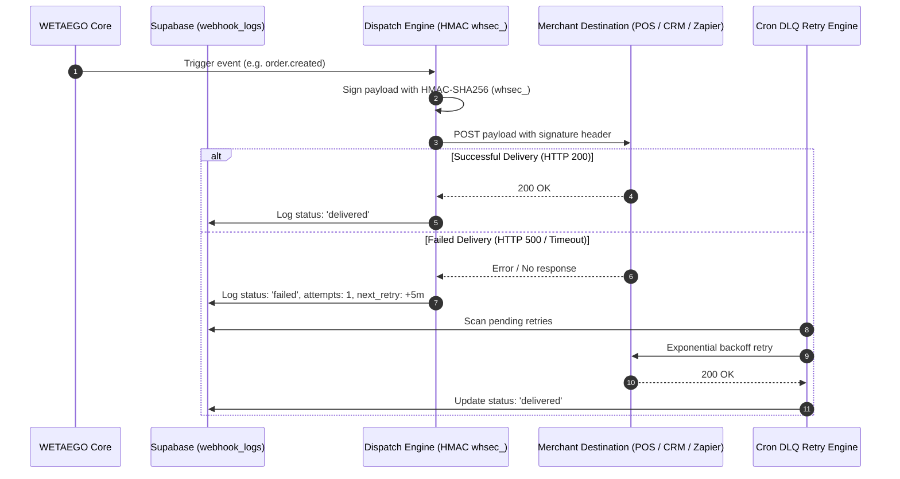

# Integrations & Fleet Management

WETAEGO seamlessly interfaces with the outside world, acting as a true enterprise hub for multi-location brands.

---

## 1. Outbound Webhook & DLQ Pipeline

---

## 2. Inbound API Gateway

Legacy point-of-sale systems and third-party CRMs can programmatically push inventory and orders *into* WETAEGO via mathematically rate-limited, Bearer-token protected REST API endpoints.

---

## 3. Custom Domains & White-Labeling

A true multi-tenant proxy layer (`proxy.ts`) intercepts requests to custom domains (e.g., `menu.luxuryhotel.com`):

- Transparently maps requests to the correct location storefront without visible redirects.
- Organizations completely white-label the customer experience, keeping their branding at the forefront.

---

## 4. Hardware Provisioning & Smart Routing

Printing physical QR codes for hundreds of tables or rooms is expensive and static.

- **Dummy QR Deployment:** Businesses can print thousands of generic "dummy" QR codes in bulk and deploy them globally.
- **Smart Re-mapping:** Using the dashboard, QR codes can be dynamically routed to specific location pages (e.g., routing a QR code from the "Main Dining" page directly to the "Spa Bookings" sub-page) without ever reprinting the physical asset.

---

## 5. Automated SaaS Lifecycle

Integrated automated email sequences (powered by Resend and Vercel Cron) autonomously handle Trial Expirations, Subscription Activations, and precise Invoicing without requiring external CRM orchestration.

---

## 6. Payment Infrastructure & Bachs Payments Platform

WETAEGO utilizes a multi-gateway abstraction layer (`lib/payments/provider.ts`) that enables frictionless switching between payment processors (Paystack, Flutterwave, and Bachs).

- **Bachs Payments Integration (`lib/payments/bachs.ts`)**:
  - **Dynamic Environment Routing**: Inspects Bearer token prefixes (`sk_sandbox_` vs. `sk_live_`) to route requests to `sandbox-api.bachs.io/v1` or `api.bachs.io/v1` automatically.
  - **Multi-Market Local Pricing (`currency_options`)**: Enables single-tier pricing in USD/NGN to automatically display localized pricing in Ghana (GHS), Kenya (KES), Uganda (UGX), Tanzania (TZS), and other African markets at checkout.
  - **In-Page Overlay Checkout (`@bachs/js`)**: Supports modal overlay checkouts (`useBachsOverlay` hook in `components/bachs-overlay-checkout.tsx`) to prevent page redirects and minimize checkout abandonment.
  - **Deposit Limit Guardrails (`400 DEPOSIT_LIMIT_EXCEEDED`)**: Intercepts single-transaction deposit limit errors ($1,000 USD / ₦1,000,000 NGN) and surfaces structured guidance for split-tender transactions.
  - **Replay-Protected Webhook Receiver (`app/api/webhooks/bachs/route.ts`)**: Validates HMAC-SHA256 signatures over `"${timestamp}.${rawBody}"` with a 300-second drift tolerance, handles idempotency in PostgreSQL, and processes 5 key operational flows (Bookings, Quotes, SaaS Subscriptions, Credit Packs, Orders) alongside subscription dunning states (`unpaid`, `past_due`, `canceled`).
