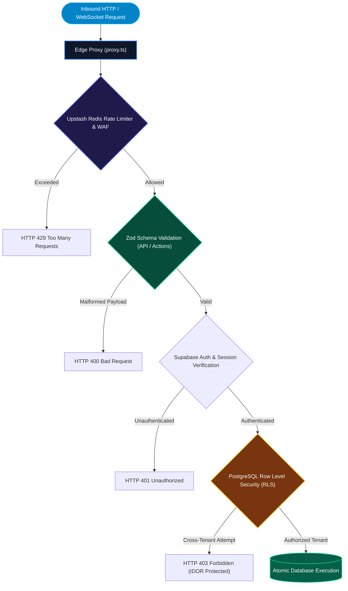

# Security & Scale

WETAEGO passes the strictest enterprise security audits. The platform's architecture is engineered to protect tenant data, scale dynamically under viral load, and seamlessly execute background processing.

---

## 1. Multi-Layer Defense & Security Architecture

---

## 2. Impenetrable API Boundaries (Zod)

Every single Server Action and API route is rigorously validated via strict `zod` schema typing.

- It is mathematically impossible for malformed payloads to reach the database layer.
- Type definitions natively map to our PostgreSQL schema, preventing SQL injections and data corruption.

---

## 3. Absolute IDOR Protection & RLS

We employ profound relational authorization matrices at the database layer (Row Level Security - RLS).

- A malicious actor cannot modify or access data belonging to another tenant or location.
- Hardware provisioning (QR mapping), location configurations, and page builder tools are cryptographically isolated.

---

## 4. Storage Protection (Denial of Wallet Defense)

Cloud storage buckets are exclusively mutated via secure server-side routes leveraging `createAdminClient`, entirely eliminating insecure public Row Level Security (RLS) policies.

- Buckets are natively locked to strict file sizes (e.g., 5MB) and MIME-type whitelists (WebP, PNG, JPEG).
- This prevents malicious bulk uploads and SDK exploitation designed to inflate storage costs.

---

## 5. N+1 Query Elimination & Infinite Scale

Data-heavy dashboards (like CRM and Order History) employ strict **cursor-based pagination**.

- This bypasses Vercel/Serverless timeout constraints.
- Guarantees instant execution whether an organization has 5 records or 5,000,000.
- Core notification and dispatcher systems utilize highly parallelized `Promise.all` fetching strategies.

---

## 6. AI-Native Operations: Fail-Safe Architecture

WETAEGO runs businesses through AI. To ensure 100% uptime:

- All Vercel AI SDK integrations (`generateObject`, `generateText`, `streamText`) and Gemini Live WebSocket streams are wrapped in rigorous exception handlers.
- AI provider timeouts, overloads, or rate limits are gracefully caught and mapped to fallback modes or polite assistance messages, guaranteeing edge functions never silently crash.
- The **Admin AI Copilot** enforces strict Role-Based Access Control (RBAC), executing key decisions while blocking unauthorized staff from accessing financial reports.
