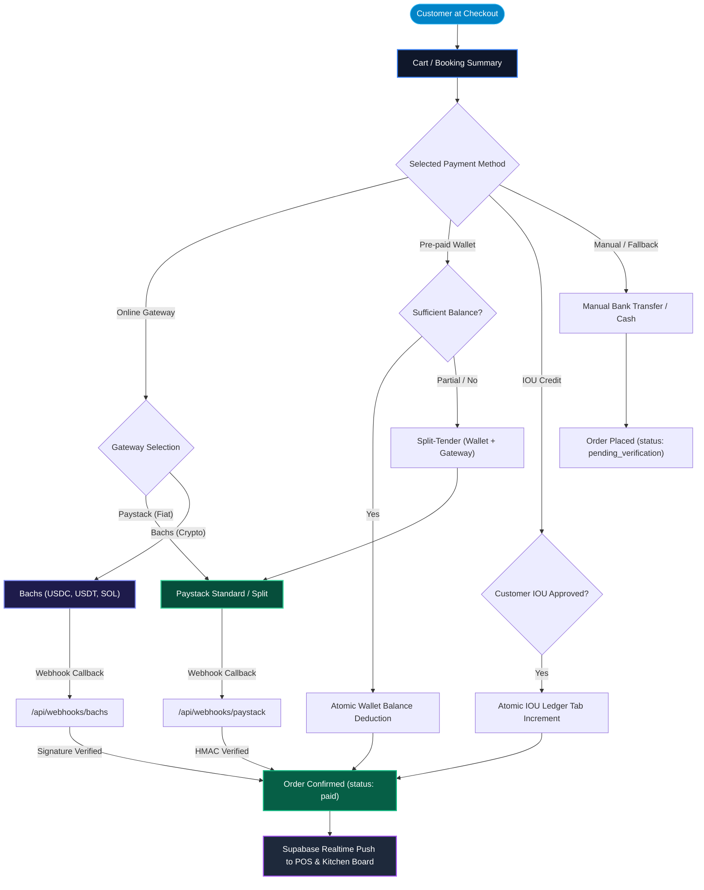

# Omnichannel Checkout & Payments

OurMenu OS utilizes a deeply unified checkout engine capable of seamlessly merging multi-item physical retail carts (Catalogs) and calendar-based reservations (Bookings) into the exact same checkout flow.

---

## 1. Unified Payment & Settlement Flow

---

## 2. Paystack & Multi-Gateway Integration

- **Split Payments:** Seamlessly handles fractional payments and automated subaccount revenue splits to merchants and staff tips.
- **Service Charges:** Dynamically calculates and injects organization-level service charges.
- **Real-Time Reconciliation:** Cryptographic Webhooks verify transaction status, updating orders in the database instantaneously.
- **Crypto Settlement:** Direct acceptance of USDC, USDT, and SOL via Bachs gateway.

---

## 3. B2B & B2C IOU (Store Credit)

Organizations can manually approve trusted customers for a "Buy Now, Pay Later" tab.

- **Credit Limits:** Dynamic limits auto-calculated based on historical spend.
- **Omnichannel Checkout:** Approved customers can bypass card/cash payments at checkout and deduct instantly from their Store Credit balance.
- **Repayment Portal:** A frictionless, no-login portal (`/m/[slug]/iou/[customerId]`) where customers can clear partial or full debt balances directly via Paystack, triggering real-time webhook reconciliation against their credit limit.

---

## 4. Global Manual Fallback

If API keys are pending or the payment provider experiences regional downtime, the system automatically degrades to a localized "Manual Bank Transfer" workflow, ensuring conversions are never blocked.

---

## 5. Viral Growth: Chaos Roulette

We built a gamified "spin to win" bill-splitting randomizer that transforms the friction of group payments into a highly engaging, viral experience.

It features 4 distinct game modes:
1. **Classic Mode:** A traditional wheel spin where one unlucky person pays the entire bill.
2. **Squad Mode:** The wheel selects a specific number of people (e.g., 2 out of 5) to split the bill evenly.
3. **Survivor Mode:** An elimination-style spin. The wheel spins multiple times, eliminating players until the last one standing pays.
4. **Chaos Mode (True Chaos):** The wheel assigns wildly disproportionate, random percentages to every single player (e.g., Player 1 pays 73%, Player 2 pays 12%, Player 3 pays 15%).

The Roulette modal seamlessly integrates with the POS and checkout engines to calculate these exact fractional splits in real-time.

---

## 6. First-Party Native Ad Network

Bypasses ad-blockers by natively injecting "Bring Your Own" (BYO) sponsors or platform-wide advertisements directly into the storefront catalog loop, generating purely passive MRR. Features zero layout shift and highly accurate `IntersectionObserver` impression tracking.
