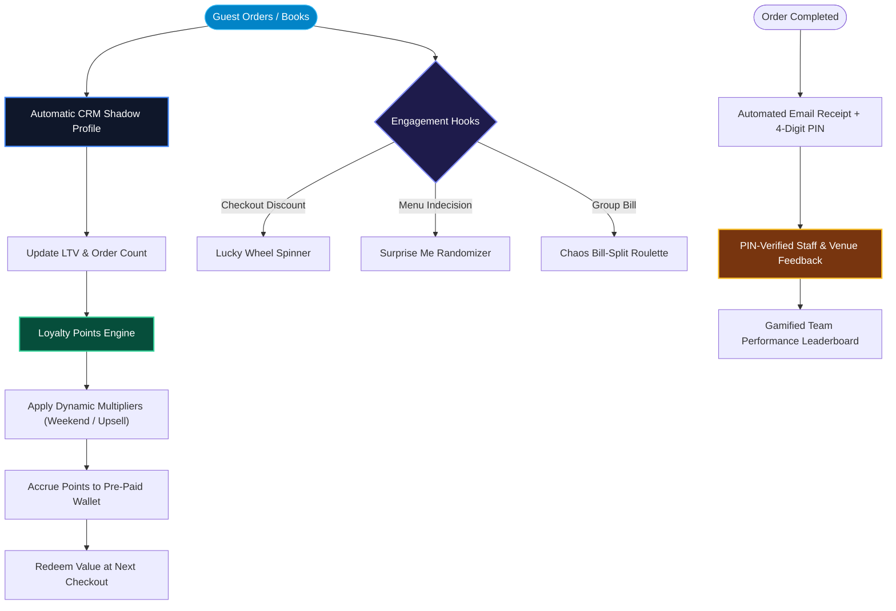

# CRM, Loyalty & Gamification

Customer retention is built directly into the core workflows, transforming one-off transactions into long-term Lifetime Value (LTV).

---

## 1. Customer Retention & Gamification Lifecycle

---

## 2. Shadow Profiles & LTV Tracking

- Automatically builds rich CRM shadow profiles at checkout, seamlessly syncing critical data like phone numbers across orders.
- Tracks Lifetime Value (LTV), order frequency, and marketing opt-ins.
- **B2C Identity Linking**: Customers can claim their shadow profiles via OTP (SMS/WhatsApp) or Email Magic Links on their order trackers, transitioning into a full B2C "My Orders" portal without data redundancy.

---

## 3. Bespoke Loyalty Programs

Organizations can launch custom point-based reward systems, configurable down to the fractional currency unit, incentivizing repeat visits without relying on external plugins.

---

## 4. PIN-Protected Post-Service Feedback

To ensure reviews are authentic and actionable:

- Automated email receipts include a cryptographic 4-digit PIN.
- Only verified customers can use this PIN to rate staff performance.
- Results populate the gamified **Team Performance Leaderboard** and the centralized **Feedback Inbox** within the dashboard.

---

## 5. Affiliate & Referral System (B2B Growth)

OurMenu OS features a built-in Affiliate system designed for aggressive B2B scaling:

- **Affiliate Dashboard:** Partners register to generate unique referral codes.
- **Hard-Linked Organizations:** New tenants that register via referral links are permanently cryptographically tied to their affiliate.
- **Automated Rev-Share:** Automated Webhooks calculate a 10% commission on every single subscription renewal and log it directly in `affiliate_earnings` for instant payout.
