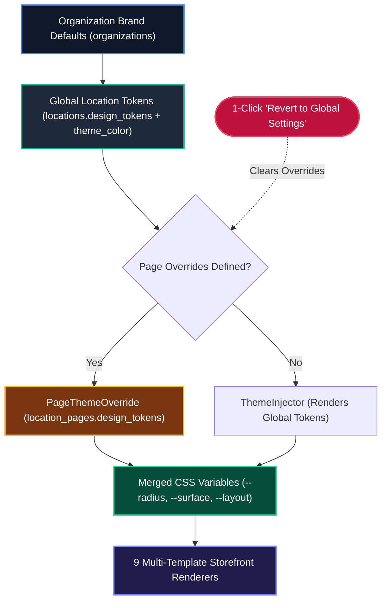
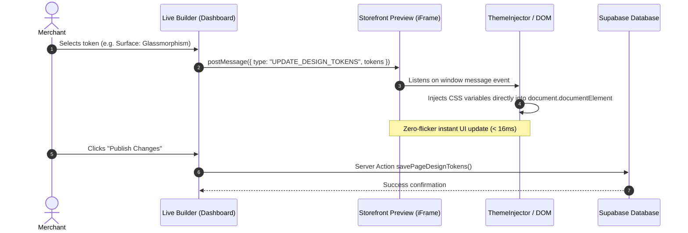

# Universal Design System, Design Tokens & Multi-Template Architecture

OurMenu OS features a decoupled design system where the visual presentation of a storefront is independent of its underlying product catalog. A merchant can transform a luxury spa booking page into a minimalist list or a vibrant bento grid in seconds, without restructuring their database records.

---

## 1. Design Token Cascade Hierarchy



---

## 2. Universal Design Tokens Engine

The visual appearance of storefronts is abstracted into a JSONB `design_tokens` schema stored at the Location level (`locations.design_tokens`) for global branding, and optionally overridden at the Page level (`location_pages.design_tokens`) for sub-sections.

```json
{
  "layout_mode": "bento_grid",
  "surface_style": "glassmorphism",
  "corner_radius": "xl",
  "typography": "modern",
  "density": "standard",
  "color_theme": "true_dark",
  "animation_style": "energetic"
}
```

### Supported Token Dimensions

- **Layout Modes**:
  - `bento_grid`: Asymmetrical hero tiles with prominent featured items, badges, and responsive auto-fit cards.
  - `masonry`: Pinterest-style dynamic column staggering, ideal for image-heavy catalogs and portfolios.
  - `list`: Ultra-compact, scannable single-column rows optimized for high-density restaurant menus.
- **Surface Styles**:
  - `flat`: Clean, modern, high-contrast borders and solid card backgrounds.
  - `glassmorphism`: Translucent frosted glass layers (`backdrop-blur-md`, subtle border reflections).
  - `neumorphism`: Soft dual-shadow inner/outer elevation for tactile, physical-feeling controls.
- **Corner Radii**: `none` (0px), `sm` (4px), `md` (8px), `lg` (16px), `xl` (24px), `full` (9999px pill).
- **Typography Families**: `modern` (Inter / Outfit), `elegant` (Playfair / serif), `playful` (Plus Jakarta), `industrial` (Space Grotesk / monospace).
- **Theme Color Schemes**: `true_dark` (#000000), `dim` (#121214), `light` (#ffffff), `tinted` (derived from brand primary hex).

---

## 3. Global vs Per-Page Token Scopes

### A. Automatic Inheritance

Pages automatically inherit the venue's global brand tokens (`locations.design_tokens` + `locations.theme_color`).

### B. Per-Page Overrides

Any page can specify customized layout modes, surface styles, or corner radii (e.g. an upscale wine list using `elegant` typography and `glassmorphism`, while the main fast-casual lunch menu uses `bento_grid` and `flat`).

### C. "Revert to Global Settings" Fail-Safe

The Live Builder includes a 1-click **"Revert to Global Settings"** button on individual pages, which clears page overrides and immediately resyncs the page with the primary brand style.

---

## 4. Live Builder Zero-Refresh Synchronization



---

## 5. The 9 Core Template Renderers

1. **Catalog & Restaurant Menu** (`menu-renderer.tsx`, `catalog-page-renderer.tsx`): Category tabs, dietary allergen filters, quantity steppers, and cart persistence.
2. **Booking & Wellness** (`booking-renderer.tsx`): Treatment duration badges, date/time calendars, deposit calculation, and reservation forms.
3. **Services & Rate Card** (`rate-card-renderer.tsx`): Package tiers, scope checklists, and hourly rate calculators for creators and freelancers.
4. **B2B Dynamic Quote** (`quote-renderer.tsx`): Interactive scope builder, milestone estimates, and custom project lead submission.
5. **Real Estate & Listings** (`listing-renderer.tsx`): Property specifications, photo galleries, virtual tours, and broker inquiries.
6. **Portfolio** (`portfolio-renderer.tsx`): Showcase tiles, project case studies, and creative work galleries.
7. **Universal Card** (`item-card.tsx`): Adaptive card with video/VR embedding, dietary badges, and structured modifiers.
8. **Multi-Page Hub Portal** (`portal-renderer.tsx`): Multi-location or multi-division parent brand hub.
9. **Live Visual Builder** (`builder.tsx`): Split-screen desktop and mobile bottom-sheet visual editor with zero-refresh `postMessage` synchronization.
