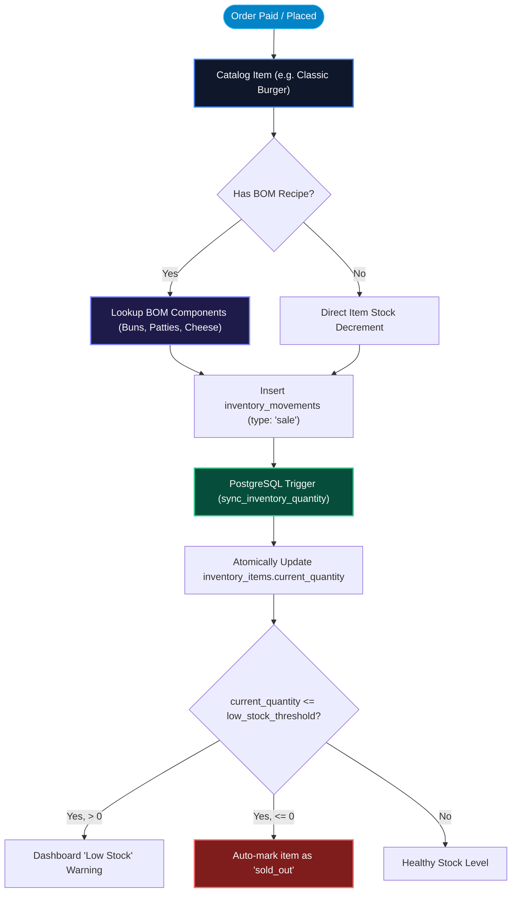

# Inventory Manager & Component Breakdown (BOM)

OurMenu OS provides a purpose-built, real-time stock management system designed for any physical business—from roadside grills and bustling cafes to high-volume tech retailers—that needs to track tangible assets without the friction of a legacy ERP.

---

## 1. Bill of Materials (BOM) & Inventory Lifecycle

---

## 2. Live Item Ledger

Every item has a running quantity, category, unit, SKU, optional cost price, reorder threshold, and notes. Items are firmly scoped per-location, ensuring multi-branch organizations stay fully isolated.

---

## 3. Component Breakdown (BOM) Engine

We eliminate manual count audits by tracking raw materials automatically:

- Dynamically map catalog products to required raw materials (e.g., a "Classic Burger" requires 1 "Bun", 1 "Patty", and 20g "Cheddar").
- When a product is sold, the system atomically calculates historical **Cost of Goods Sold (COGS)** and deducts the exact ingredient quantities from the ledger.

---

## 4. 5 Movement Types & Signed Triggers

- Track `Restock`, `Use`, `Wastage/Loss`, `Sale`, and `Manual Adjustment` — each with an optional note for accountability.
- A strictly enforced Postgres trigger (`sync_inventory_quantity`) atomically applies every movement to the item's `current_quantity`, making the entire ledger safe against race-conditions during viral traffic spikes.
- Outbound movements (Use, Sale, Wastage) actively block submission at the database layer if the stock would drop below zero.

---

## 5. Smart Sell-Out & Order Cancellation

- **Atomic Sell-Out Tracking:** Items automatically switch to a visible *Sold Out* state instantly when availability reaches zero.
- **Cancellation Lifecycle:** Businesses can safely reject orders with a logged reason for analytics. The engine provides the option to instantly restock the rejected inventory back into the ledger.
- **Optimistic UI Validation:** Waitstaff and managers can modify stock limits dynamically from the dashboard without ever triggering a page refresh.
