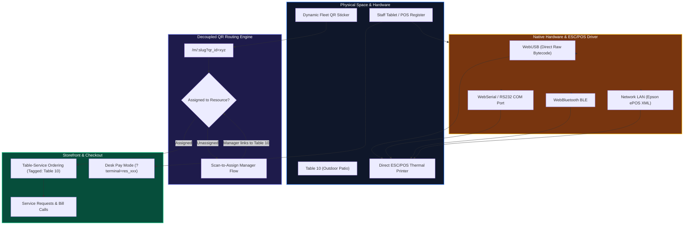

# Visual Resource Manager & POS

The **Visual Resource Manager (VRM)** is the bridge between WETAEGO's digital ordering system and the physical reality of a business location. Whether mapping tables in a restaurant, bays in an auto shop, or rooms in a hotel, the VRM allows for a dynamic connection between physical space and digital transactions.

---

## 1. Dynamic QR Routing & POS Architecture

---

## 2. Unified Resource & QR Architecture

In WETAEGO, physical resources and their tracking mechanisms are tightly integrated:

### The Philosophy of Dynamic QRs

We do not charge for physical printouts or static storefront links. Merchants can print 1,000 copies of a single static QR code for free. We monetize **Intelligence and Uniqueness**. When a business needs unique routing and tracking per physical resource (e.g., Table 1 vs Table 2 vs Front Register) to link POS carts and pinpoint feedback, they generate **Dynamic QRs**. These unique database records draw from the unified credit pool, aligning our revenue directly with the true value of our routing engine.

### Core Architecture

- **Resources (`resources` table):** Represents fixed physical locations (e.g., "Table 15", "Front Register"). Each resource belongs to a specific zone (e.g., "Patio").
- **QR Codes (`qr_codes` table):** Tracks unique identifiers generated by the system.
  - **Dynamic Fleet QRs:** Pre-generated QR codes that use credits from the plan. These can be printed in bulk and then physically assigned to tables later using a "Scan-to-Assign" process.
  - **Resource-Linked QRs:** Generated directly for a specific resource, linking it to the cart flow.

---

## 3. Storefront Links (Static) vs. Dynamic Fleet

### Static Storefront QRs (Free)

- Point to static URLs like `/m/venue-slug` or `/m/venue-slug/p/menu`.
- Do **not** carry unique session IDs or table identifiers.
- Free and do not deduct credits. Useful for generic marketing, front door posters, or digital billboards.

### Dynamic QR Fleet (Credit-Based)

To solve the common problem of "QR tents moving around," WETAEGO supports a dynamic QR fleet:

- Businesses can generate a batch of unassigned dynamic QRs (deducting 1 credit each).
- These are printed and placed on tables.
- A waiter/manager scans the QR and assigns it to "Table 12".
- This decouples the physical printout from the digital mapping. If a table tent is lost or moved, the manager simply re-assigns the QR.

---

## 4. Hardware Locking (Desk Pay)

A resource of type `register` can be used to lock a POS terminal:

- When the URL contains `?terminal=res_xxxx`, the checkout flow enters **Desk Pay** mode.
- In this mode, the POS interface is active, enabling cash payments and direct order dispatch from a staff-operated device.

---

## 5. Native Raw Hardware ESC/POS Binary Printing

WETAEGO contains a zero-dependency, native ESC/POS bytecode engine (`lib/utils/escpos-driver.ts`) that writes raw binary bytes directly to thermal receipt printers from modern browsers:

- **WebUSB (`navigator.usb`):** Direct USB endpoint communication with thermal printers. Zero print dialogs, zero desktop daemons, instant hardware paper cuts, and cash drawer kick pulses (`ESC p`).
- **WebSerial / COM (`navigator.serial`):** RS-232 and virtual COM port support with configurable baud rates (9600 to 115200).
- **WebBluetooth BLE (`navigator.bluetooth`):** Wireless thermal receipt printing to portable mobile belt printers.
- **Epson ePOS XML & Kiosk HTML:** Network LAN printing and universal fallback iframe printing.

---

## 6. UI Consolidation

The **Resources & QRs** dashboard unifies this workflow into three tabs:

1. **Fixed Resources:** To create Zones, Tables, and Registers.
2. **Storefront QRs:** Free, static links for direct portal access.
3. **Dynamic QR Fleet:** To generate, manage, and assign generic QRs for print-first workflows.
