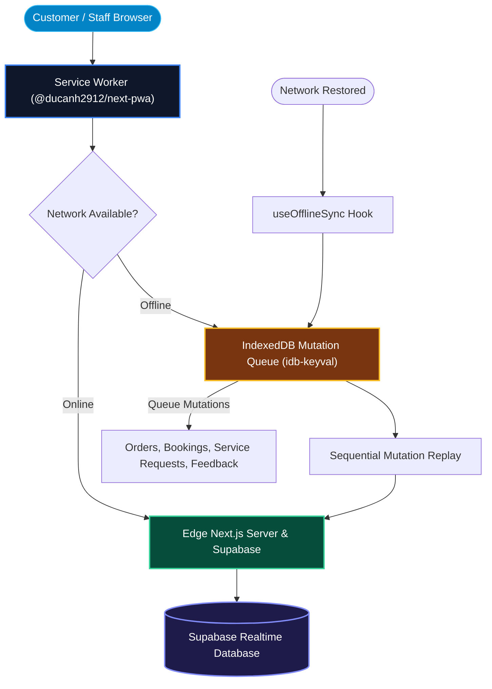

# True Native App Experience, SEO & Communications

OurMenu OS utilizes cutting-edge web capabilities to deliver a completely frictionless experience that rivals, and often surpasses, native mobile applications.

---

## 1. PWA Service Worker & Offline Sync Pipeline

---

## 2. PWA & Fluid Aesthetics

- **Service Workers (SW):** Intelligent caching layers intercept network requests, allowing menus to load instantly even on patchy cellular connections, completely bypassing native app store friction.
- **Framer Motion Animations:** A deeply considered, fluid UI featuring 60fps micro-interactions, hardware-accelerated transitions, and premium components.
- **Universal Design Tokens:** Total aesthetic control (`bento_grid`, `masonry`, `list`, `glassmorphism`, `neumorphism`, `corner_radius`).

---

## 3. Omnichannel Communications

- **Web Push API:** Direct-to-device push notifications alert customers when their orders are ready, and alert staff when new tickets arrive or assistance is needed.
- **Termii SMS / WhatsApp:** Fallback communication protocols trigger OTP verification or dispatch automated order receipts and repayment portal links via SMS/WhatsApp in regions where push notifications are disabled.

---

## 4. Global SEO, AEO & Privacy Compliance

Our public-facing catalogs are engineered for maximum discoverability:

- **JSON-LD Structured Data:** Automatically injects rich semantic schemas (`LocalBusiness`, `Product`, `Menu`) for products and services, securing premium real estate in Google Search results (Rich Snippets).
- **Answer Engine Optimization (AEO):** Next-gen AEO structures ensure products are rapidly indexed and recommended by LLM-based search engines (like ChatGPT, Perplexity, and Google Gemini).
- **Privacy Compliance (GDPR/CCPA):** Built-in Cookie Consent layers, automated right-to-be-forgotten webhooks, and strict anonymization protocols for customer data handling.
