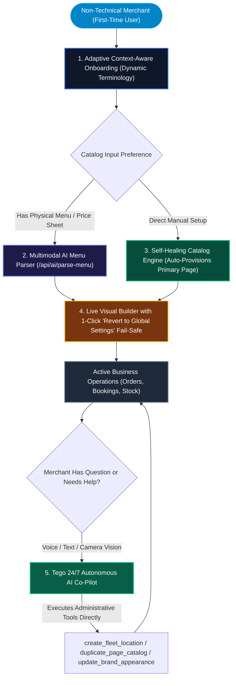

# The 5 Pillars of Self-Service "Human-Proof" UX

WETAEGO is engineered with a strict design philosophy: **A business software platform is only truly finished when non-technical operators can configure, launch, manage, and scale their business without ever needing to contact or pester the software developer.**

This document details the architectural mechanisms, fail-safes, and self-guiding layers that make WETAEGO completely autonomous and human-proof.

---

## 1. Self-Service Architecture & Lifecycle Pipeline

---

## 2. The 5 Core Pillars

### Pillar 1: Adaptive Context-Aware Onboarding Engine

- **Implementation**: [`app/(dashboard)/dashboard/components/onboarding-checklist.tsx`](file:///d:/pacy_labs/ourmenu/app/(dashboard)/dashboard/components/onboarding-checklist.tsx)
- **Mechanism**: Rather than forcing a generic, rigid onboarding flow, the checklist dynamically adapts its terminology and requirements to the business's chosen industry preset:
  - **Hospitality & Retail (`catalog`)**: *"Create your catalog"* ➔ *"Add your first menu items, products, or drinks."*
  - **Freelancers & Agencies (`rate_card`)**: *"Create your rate card"* ➔ *"Add your service offerings and consulting packages."*
  - **Spas, Salons & Clinics (`booking`)**: *"Set up services"* ➔ *"Add your available treatments and booking durations."*
  - **Real Estate & Automotive (`listing`)**: *"Create listings"* ➔ *"Add your available properties, vehicles, or items."*
- **Fail-Safe**: Persists progress state in `localStorage` and dismisses cleanly once complete, preventing UI clutter while remaining resume-friendly.

---

### Pillar 2: Self-Healing State & Auto-Provisioning Pipeline

- **Implementation**: [`app/(dashboard)/dashboard/menu/page.tsx`](file:///d:/pacy_labs/ourmenu/app/(dashboard)/dashboard/menu/page.tsx#L57-L74)
- **Mechanism**: Traditional software breaks or shows cryptic empty screens when a user navigates to a sub-manager before completing prerequisite steps. In WETAEGO:
  - If a user visits the **Catalog Manager** before explicitly creating a page in the wizard, the backend server detects the missing relation and **automatically provisions a default Primary Catalog page** (`location_pages`) on the fly.
  - The merchant never encounters a blank screen, a 404 error, or a disabled interface.

---

### Pillar 3: Multimodal AI Menu & Price Sheet Ingestion

- **Implementation**: [`auto-import-button.tsx`](file:///d:/pacy_labs/ourmenu/app/(dashboard)/dashboard/menu/auto-import-button.tsx) & `/api/ai/parse-menu`
- **Mechanism**: Manual data entry is the #1 drop-off point for non-technical merchants onboarding to digital systems.
  - Merchants can upload an existing PDF, PNG, JPEG, or snap a photo of their printed physical menu, paper price board, or clipboard.
  - Gemini Vision extracts item names, descriptions, prices, categories, and dietary tags into structured JSON.
  - The catalog is instantly populated in seconds with zero manual typing required.

---

### Pillar 4: Tego 24/7 Autonomous Voice & Chat Co-Pilot

- **Implementation**: [`ai-copilot-widget.tsx`](file:///d:/pacy_labs/ourmenu/app/(dashboard)/dashboard/components/ai-copilot-widget.tsx) & [`app/api/ai/copilot/route.ts`](file:///d:/pacy_labs/ourmenu/app/api/ai/copilot/route.ts)
- **Mechanism**: Non-technical operators do not read developer manuals. Tego provides a persistent, multimodal co-pilot in the merchant dashboard:
  - **Conversational Guidance**: Merchants ask plain-language questions via text or real-time voice (*"How do I set up delivery fees?"*, *"How do I connect my Bluetooth thermal printer?"*).
  - **Autonomous Tool Execution**: When instructed (*"Open a second branch in Ikeja and copy our supermarket catalog over"*), Tego directly executes administrative tools (`create_fleet_location`, `duplicate_page_catalog`, `update_brand_appearance`) to perform the action in real time.
  - **Camera Vision Inspection**: Merchants can show Tego physical dishes or stock shelves via camera to digitize items or troubleshoot layouts.

---

### Pillar 5: Live Visual Builder with 1-Click Zero-Risk Fail-Safes

- **Implementation**: [`builder.tsx`](file:///d:/pacy_labs/ourmenu/app/(dashboard)/dashboard/appearance/builder.tsx) & [`ThemeInjector`](file:///d:/pacy_labs/ourmenu/app/m/[slug]/theme-injector.tsx)
- **Mechanism**: Merchants want complete visual control over their brand without the risk of breaking their live website.
  - **Instant WYSIWYG Feedback**: Changes to surface styles (glassmorphism, neumorphism), typography, layout modes (bento grid, masonry, list), and corner radii sync to an interactive mobile preview iframe in `< 16ms` via `postMessage`.
  - **1-Click "Revert to Global Settings" Fail-Safe**: If a merchant modifies individual page styles and gets confused or produces an unbalanced design, a single click on **"Revert to Global Settings"** clears all overrides and immediately re-synchronizes the page with the clean, primary brand tokens.

---

## 3. Human-Proof Error Boundaries & Feedback Protocols

1. **Zero Technical Jargon**: All API and mutation errors are intercepted by `SafeResult` and mapped to human-friendly explanations (e.g. converting a duplicate slug error to *"This URL is already taken. Please choose a unique name."*).
2. **Deterministic Loading States**: Every interactive button enforces `disabled={isPending}` and renders a visual spinner to prevent multi-click duplicate submissions.
3. **Resilient Error Boundaries**: [`error.tsx`](file:///d:/pacy_labs/ourmenu/app/error.tsx) and [`not-found.tsx`](file:///d:/pacy_labs/ourmenu/app/not-found.tsx) provide instant self-service recovery actions (*"Return to Dashboard"*, *"Try Again"*), completely eliminating White Screen of Death (WSOD) states.
