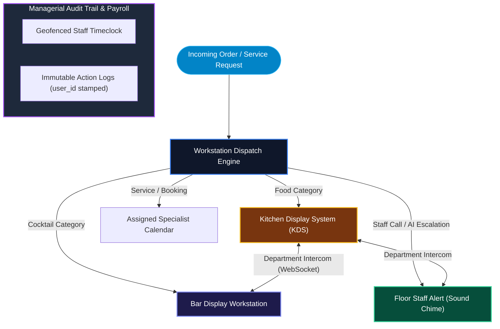

# Enterprise Team & Intercom Orchestration

Managing a high-traffic business requires seamless internal communication and strict operational oversight.

---

## 1. Department Workstation & Intercom Architecture

---

## 2. Department Routing

Workflows are intelligently routed based on department:

- Physical items are routed to Kanban workstations (Kitchen, Bar, Grill) based on category.
- Custom service bookings are routed to the specific calendar of the assigned staff member.

---

## 3. Realtime Chat & WebSockets

A dedicated Intercom module powered by Supabase WebSockets enables zero-latency internal communication.

- **Rich Media Sharing:** Waitstaff can securely snap photos of complicated tables or incidents and instantly upload them to the internal chat.
- **Persistent Channels:** Chat channels are permanently scoped to the organization and isolated from public access.

---

## 4. Managerial Oversight

- **Action Logs:** Critical administrative actions (such as voiding an order, manually restocking inventory, or granting Store Credit) are immutably logged with the `user_id` of the actor to ensure full accountability.
- **Shift Auditing:** Managers can export historical Geofenced Clock-In records to reconcile payroll disputes instantly.
