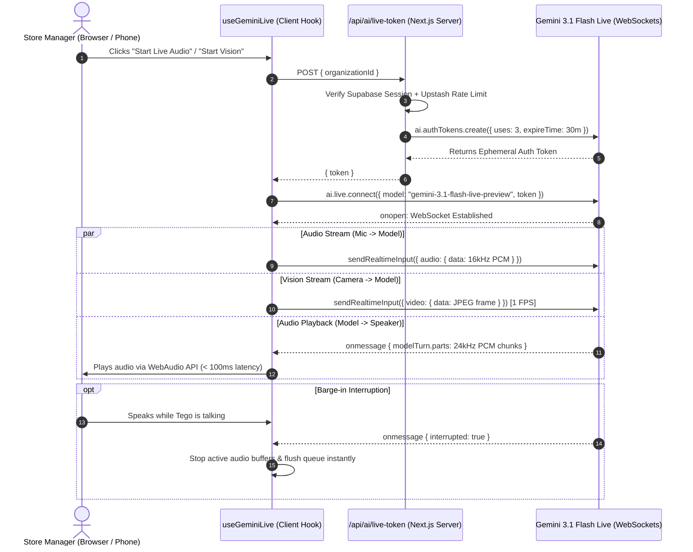
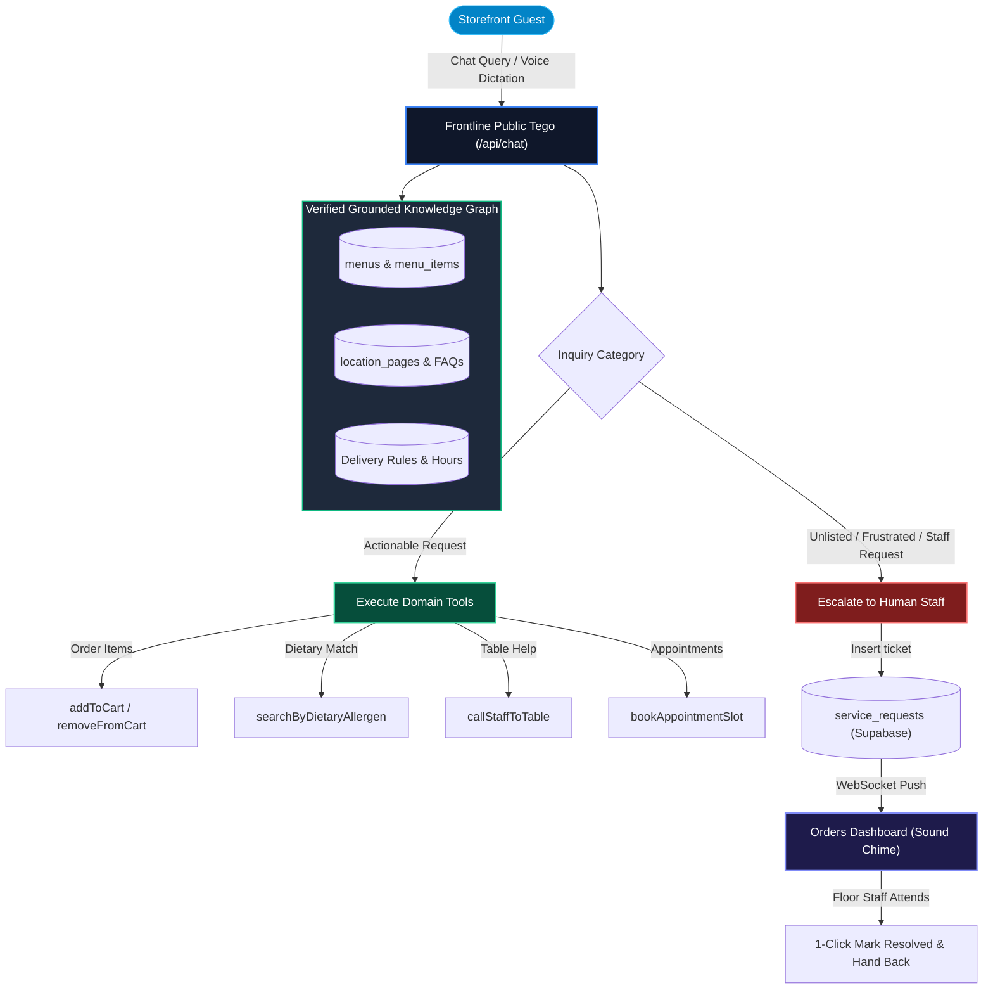

# Tego AI: Real-Time Multimodal Voice, Vision & Frontline Public Assistant

WETAEGO features a dual-layer AI architecture designed to streamline business operations and automate frontline customer interactions with zero hallucinations.

---

## 1. Dual AI Engine: Admin Co-Pilot vs. Frontline Public Assistant

```mermaid
flowchart TD
    subgraph AdminLayer ["Merchant Operations Layer"]
        Merchant(["Merchant / Store Manager"]) -->|"Voice (16k/24k PCM) / Camera Stream"| GeminiLive["Tego Multimodal Live (Gemini 3.1 Flash Live)"]
        Merchant -->|"Text Chat Co-Pilot"| AdminCopilot["Admin AI Co-Pilot (/api/ai/copilot)"]
        GeminiLive & AdminCopilot --> AdminTools["Admin Tool Execution"]
        AdminTools --> T1["update_brand_appearance"]
        AdminTools --> T2["get_business_structure"]
        AdminTools --> T3["get_recent_orders"]
        AdminTools --> T4["create_fleet_location"]
        AdminTools --> T5["duplicate_page_catalog"]
    end

    subgraph PublicLayer ["Customer Frontline Layer"]
        Customer(["Guest / Customer (/m/:slug)"]) -->|"Text / Voice Inquiry"| PublicChat["Frontline Public Tego (/api/chat)"]
        PublicChat --> GroundingCheck{"Grounded in DB?"}
        GroundingCheck -->|"Yes (Menu/FAQ/Hours)"| PublicTools["Autonomous Tool Calling (Cart/Booking/Dietary)"]
        GroundingCheck -->|"No / Escalation Needed"| ServiceReq[("service_requests (Supabase Realtime)")]
        ServiceReq -->|"Instant WebSocket Push"| StaffDashboard["Orders Dashboard (Sound Chime)"]
    end

    style AdminLayer fill:#0f172a,stroke:#3b82f6,stroke-width:2px,color:#fff
    style PublicLayer fill:#1e1b4b,stroke:#818cf8,stroke-width:2px,color:#fff
    style GeminiLive fill:#064e3b,stroke:#34d399,stroke-width:2px,color:#fff
    style PublicChat fill:#78350f,stroke:#fbbf24,stroke-width:2px,color:#fff
    style StaffDashboard fill:#065f46,stroke:#10b981,stroke-width:2px,color:#fff
```

---

### A. Real-Time Gemini Multimodal Live API

- **Model**: `gemini-3.1-flash-live-preview` via `@google/genai`.
- **Ephemeral Token Minting (`/api/ai/live-token`)**: Server generates secure, short-lived session tokens ensuring client API keys are never exposed.
- **Bidirectional WebAudio Streaming (`hooks/use-gemini-live.ts`)**:
  - Mic audio captured and resampled to 16kHz PCM chunks.
  - Model audio streams back at 24kHz PCM for natural, low-latency vocal delivery.
  - **Instant Barge-In Interruption**: Speaking while Tego is responding immediately interrupts model output and switches to listening mode.
- **Tego Vision (Camera Streaming)**:
  - Streams live camera frames at 1 FPS (JPEG canvas extraction).
  - Supports front/back camera toggling for mobile inspections.
  - Merchants can point cameras at physical dishes, stockroom shelves, paper invoices, or handwritten notes for instant real-time analysis.

### B. Admin Administrative Tools

- `update_brand_appearance`: Voice-controlled updates to layout modes, surface styles, corner radii, and color palettes.
- `get_business_structure`: Inspect active locations and pages.
- `get_recent_orders`: Check incoming orders and ticket status.
- `create_fleet_location`: Autonomously launch new physical store branches.
- `duplicate_page_catalog`: Autonomously clone product catalogs across branches.
- `query_os_documentation`: Instant RAG lookup over technical platform specifications (`/llms-full.txt`).

---

## 2. Frontline Public Tego Assistant & Smart Defaults

The customer-facing AI on `/m/[slug]` provides a unified, zero-friction experience tailored to the business type.

---

### A. Persona & Naming Architecture (`lib/templates/ai-personas.ts`)

- **Custom Name Configuration**: If the business defines a custom name in Settings (`locations.ai_name`), it displays as `"{customName} • {businessName}"`.
- **Default Fallback**: Automatically brands as `"Tego • {businessName}"` (e.g. *"Tego • Blue Ribbon Bistro"*).
- **Business-Adaptive Subtitles & Suggestion Chips**:
  - *Hospitality*: Live Dining & Table Assistant (`["🍽️ Recommendations", "🥜 Allergen check", "🧾 Request the bill", "🙋 Call waiter"]`)
  - *Salon / Spa*: Wellness & Booking Specialist (`["📋 Available services", "📅 Check calendar slots", "💬 Connect with coordinator"]`)
  - *Retail / Catalog*: Product & Catalog Guide (`["🔍 Check item specs", "📦 Stock availability", "💬 Connect with staff"]`)
  - *Real Estate*: Property & Listing Advisor (`["🏡 Property specs", "📍 Amenities", "📅 Schedule a viewing"]`)
  - *Agency / Quote*: Scope & Quote Specialist (`["📑 Tier breakdown", "💰 Estimate project", "📞 Schedule consultation"]`)

### B. Autonomous Public Tool Execution (`app/api/chat/route.ts`)

- `addToCart`, `removeFromCart`, `clearCart`, `checkout`
- `searchByDietaryAllergen` (vegan, halal, gluten_free, nut_free, keto)
- `callStaffToTable` (waiter, bill, cleanup, water, manager escalation)
- `checkAvailability`, `getServiceDetails`, `bookAppointmentSlot`
- `getProductSpecs`, `checkStock`, `requestSalesAssociate`
- `submitCustomQuoteLead`, `requestConsultantCallback`
- `requestStaffHandoff`

### C. Zero-Hallucination Grounding

1. Strictly limited to facts in verified database tables (`menu_items`, `page_items`, `ai_faqs`, `brand_knowledge`, `operating_hours`, `delivery_rules`).
2. When information is unlisted or absent, Tego is prohibited from guessing or fabricating. It politely informs the customer and triggers an automated escalation ticket in `service_requests`.
