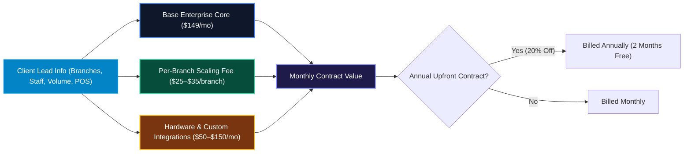

# Enterprise Fleet & Multi-Branch Pricing Guide

This document outlines the standardized pricing algorithm and contract formulation methodology for multi-location businesses, supermarket chains, and franchise venues on OurMenu OS.

---

## 1. The Core Enterprise Pricing Formula

```text
Total Enterprise Monthly Fee = Base Platform Fee + (Branch Count × Per-Branch Tier Fee) + Optional Modules
```



---

## 2. Component Breakdown

### A. Base Enterprise Platform Fee ($149 / month)
Covers core multi-tenant enterprise infrastructure:
- **Global HQ Dashboard**: Consolidated analytics, revenue aggregation, and cross-branch inventory search.
- **Master Catalog Duplication Engine (`duplicatePageAction`)**: 1-click replication of 5,000+ items across new branches in `< 1s`.
- **Advanced Franchise RBAC**: Scoping branch managers and staff to individual stores or sub-departments.
- **Priority 24/7 SLA & Direct Engineering Channel**.

### B. Per-Branch Scaling Rates

| Branch Volume Bracket | Per-Branch Fee | Monthly Price Example |
| :--- | :---: | :--- |
| **2 to 5 Physical Branches** | **$35 / branch / mo** | 3 Branches = $149 + (3 × $35) = **$254 / mo** |
| **6 to 15 Physical Branches** | **$30 / branch / mo** | 8 Branches = $149 + (8 × $30) = **$389 / mo** |
| **16 to 50+ Branches (Enterprise)** | **$25 / branch / mo** | 20 Branches = $149 + (20 × $25) = **$649 / mo** |

### C. Optional High-Value Enterprise Add-Ons

- **Direct Raw Thermal ESC/POS Fleet Configuration**: +$50/mo (Includes multi-register setup across bars/kitchens/cash registers).
- **Sub-Department Aisle Routing (Supermarket Aisles/Bakery/Deli)**: Included free on 3+ branches.
- **Custom ERP / SAP / Inventory Accounting API Sync**: +$150/mo (or $1,000 one-time onboarding setup).
- **Custom Domain SSL per Branch (e.g. `order.megamart-lekki.com`)**: +$10/branch/mo.

---

## 3. How to Price a Lead from the Intake Form (Step-by-Step)

When a new lead arrives in your inbox or database from `EnterpriseQuoteModal`:

1. **Step 1: Check Branch Count**:
   - If 4 branches ➔ $149 base + (4 × $35) = **$289 / month**.
2. **Step 2: Check Staff Size & Volume**:
   - Up to 10 staff members per branch are included free.
   - If they have a massive workforce (>150 staff) with high shift turnover, add a **+$50/mo Workforce Scheduling Module**.
3. **Step 3: Check Hardware Needs**:
   - If they checked **"Raw ESC/POS Thermal Printers"** or **"KDS Tablet Stations"**, add **+$50/mo Hardware Support**.
4. **Step 4: Offer Annual Contract Incentive**:
   - Standard Monthly: **$289 / mo**
   - Annual Pre-Paid: **$231 / mo** ($2,772 / year — saving them $696/year while guaranteeing 12-month cash upfront).

---

## 4. Closing the Deal: Ready-to-Use Email / WhatsApp Template

```text
Hi [Contact Name],

Thank you for requesting an Enterprise Fleet proposal for [Company Name] ([Branch Count] locations).

Based on your team size and operational needs across [Branch Count] branches, here is your customized OurMenu OS Enterprise breakdown:

• Global HQ Executive Dashboard & Fleet-Wide Analytics
• 1-Click Master Catalog Cloning (instantly deploy 5,000+ items across new branches)
• Granular Store-Level RBAC for your branch managers
• [Optional Hardware Module / Thermal Printing]
• 24/7 Priority SLA & Dedicated Solutions Architect

Custom Enterprise Rate:
• Monthly Plan: $[Monthly Rate] / month
• Annual Plan (20% Savings): $[Annual Rate] / month (billed annually)

Would you like to schedule a 10-minute onboarding walkthrough or shall we provision your Enterprise organization credentials today?

Best regards,
OurMenu OS Enterprise Team
```
