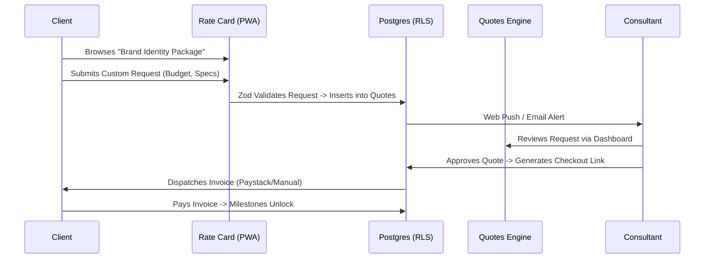

# Industry Use Case: Consultants & Agencies (B2B)

For knowledge workers, freelancers, design agencies, and legal consultants, OurMenuOS replaces fragmented invoicing tools with an integrated Rate Card and Quotes engine.

## Data Flow: Rate Cards & Quotes

## Key B2B Features

1. **The Quotes Engine:** B2B services often lack fixed pricing. The system allows consultants to expose a "Rate Card" where clients can submit highly customized briefs. The backend CRM manages the negotiation lifecycle (Draft, Pending Approval, Accepted, Rejected).
2. **Custom Fulfillment Milestones:** The Kanban board is overridden to reflect typical consulting deliverables (e.g., Discovery, Wireframes, Revisions, Final Handoff).
3. **B2B Invoicing:** Approved quotes automatically generate beautiful, downloadable PDF invoices via an Edge Function, deeply integrated with the platform's Store Credit (IOU) tracking if the client is on a retainer.
