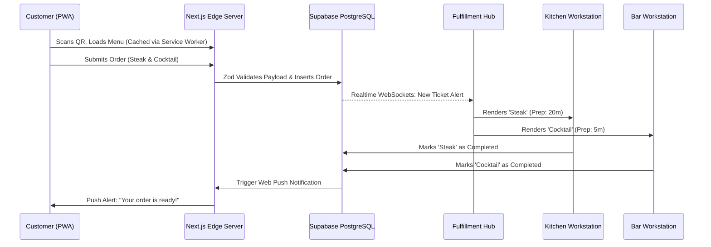

# Industry Use Case: Hospitality (Restaurants, Cafes, Bars)

OurMenuOS originated as a hospitality solution before evolving into a universal operating layer. It completely bypasses legacy Point of Sale constraints by delivering a frictionless, QR-driven ordering experience coupled with an immensely powerful backend Fulfillment Hub.

## Data Flow: From Customer to Kitchen

The system intelligently fragments orders. A customer at Table 4 can order a Steak and a Cocktail in the same transaction. The backend splits this ticket: the Grill workstation only sees the Steak, and the Bar workstation only sees the Cocktail.

## Key Hospitality Features

1. **Smart Sell-Out Engine:** Automatically tracks finite ingredients (BOM Engine) via race-condition-free database RPCs, switching items to *Sold Out* instantly when availability drops to zero.
2. **Payment Roulette & Gamification:** Converts the painful process of splitting a group restaurant bill into a viral "Spin the Wheel" game directly at the table.
3. **Dedicated POS Module:** For walk-in customers or cash-payers, staff utilize a dedicated `/dashboard/pos` module optimized for rapid, cash-register-style entry.
