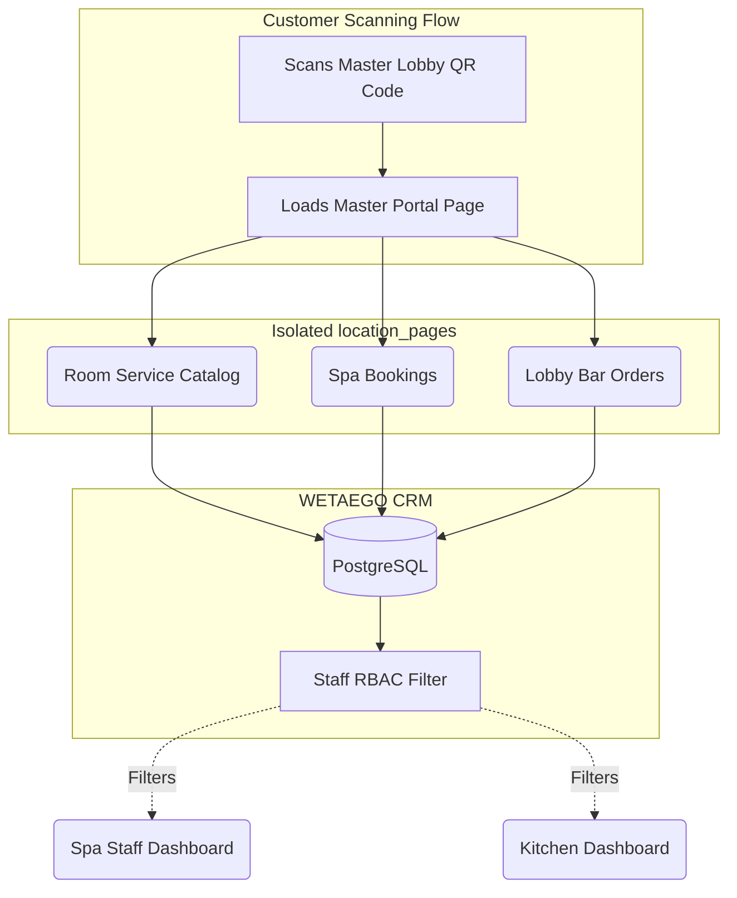

# Industry Use Case: Portal Mode (Macro-Routing)

For massive enterprise operations, the standard single-catalog flow is insufficient. A sprawling Hotel requires a completely different architectural approach to handle multiple discrete business units under one roof.

## Data Flow: Macro-Landing Routing

Portal Mode functions as a "Macro-Landing Page" that aggregates multiple isolated sub-businesses.

## Key Enterprise Features

1. **Sub-Business Isolation:** Each endpoint in the Portal (Room Service, Spa) acts as an entirely independent tenant. They maintain their own specific Wi-Fi details, operating hours, active AI prompts, and catalogs.
2. **Staff RBAC Segregation:** The Spa team only receives notifications and sees data for Spa Bookings. The Kitchen team only sees Room Service orders. This prevents massive dashboard clutter and cross-departmental confusion.
3. **Unified Brand Aesthetics:** Despite the functional isolation, the parent organization's styling parameters (accent colors, fonts, background images) cascade down to all sub-businesses, maintaining a cohesive enterprise aesthetic.
