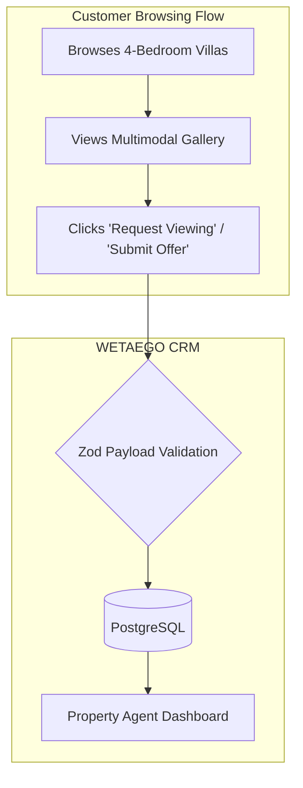

# Industry Use Case: Real Estate & Automotive

WETAEGO seamlessly adapts to high-ticket, inquiry-based industries where physical catalogs serve as lead-generation tools rather than instant-checkout endpoints.

## Data Flow: Inquiry-Based Catalogs

## Key High-Ticket Features

1. **Lead Generation Mode:** The traditional checkout Cart is overridden. Items are flagged as "Inquiry Only," routing users to a dedicated lead-capture form instead of a payment gateway.
2. **Deep Categorization (Taxonomy Engine):** Real Estate portfolios utilize the massive flexibility of the Taxonomy Engine to categorize listings by Neighborhood, Square Footage, Price Bracket, and Amenities.
3. **Agent Workstations:** Inquiries are routed directly to specific Property Agents using the Workstation triaging logic, allowing agents to respond to leads via the internal CRM.
