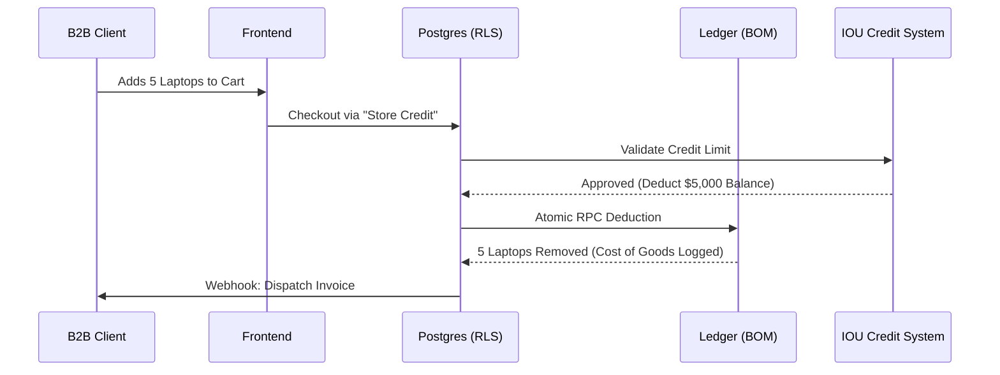

# Industry Use Case: Retail & B2B (Boutiques, Tech Stores, Agencies)

Physical retail and B2B wholesale demand incredibly rigid inventory tracking, customer profiling, and specialized product states. OurMenuOS delivers this via a dedicated Catalog Template.

## Data Flow: Inventory & Store Credit

Retail businesses use our **Store Credit (IOU) System** and the **Component Breakdown (BOM) Engine** to handle B2B clients and track precise inventory.

## Key Retail Features

1. **Component Breakdown (BOM) Engine:** Dynamically maps catalog products to required raw materials (e.g. a "Custom PC" requires 1 "Motherboard" and 1 "GPU"). The system atomically calculates historical Cost of Goods Sold (COGS) and deducts exact ingredient quantities via a signed Postgres trigger.
2. **Product Conditions:** Intelligent catalog system that detects standard "Condition" variants (New, Used, Refurbished) and automatically renders premium color-coded badges and dedicated filter bars for retail layouts.
3. **Customer IOU & Store Credit:** B2B organizations can manually approve trusted customers for a "Buy Now, Pay Later" tab. A Vercel Cron orchestrator intelligently identifies customers whose balance exceeds thresholds and dispatches HTML emails with direct repayment links.
