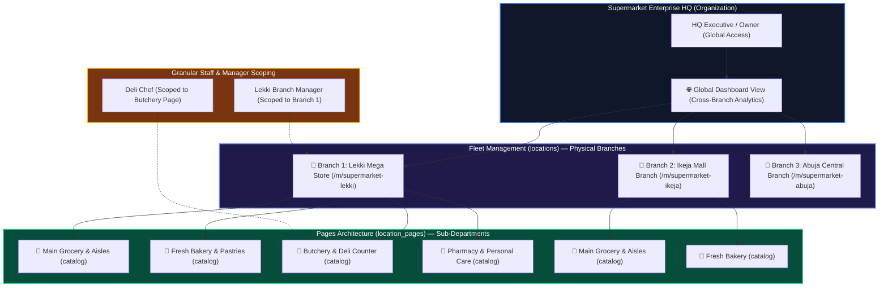

# Industry Use Case: Supermarkets & Multi-Branch Retail Chains

OurMenu OS provides an enterprise operating layer engineered for large-scale grocery stores, supermarket franchises, and multi-branch retail networks.

---

## 1. Fleet vs. Sub-Department Architecture

---

## 2. Supermarkets in Onboarding & Templates

- **Template Selection:** Supermarkets select the **Catalog / Retail Template** (`template_type: 'catalog'`).
- **High-Density Aisles:** Employs high-density list and bento grid views optimized for browsing thousands of SKUs across product aisles (Produce, Dairy, Bakery, Butchery, Beverages, Household, Meat/Poultry, Snacks).
- **Taxonomy & Collections:** Products are categorized into Aisle Collections with dietary/allergen filters, barcodes, and real-time inventory counts.

---

## 3. Pages Architecture vs. Fleet Management

| Dimension | **Pages Architecture (`location_pages`)** | **Fleet Management (`locations`)** |
| :--- | :--- | :--- |
| **Concept** | **Sub-Businesses & Internal Departments** | **Physical Branches & Franchise Locations** |
| **Use Case** | Distinct departments within one store (e.g. Grocery Aisles, In-Store Bakery, Fresh Butchery, Hot Deli, Pharmacy). | Multiple physical stores across cities/regions (e.g. Lekki Branch, Ikeja Branch, Abuja Branch). |
| **Autonomy** | Unique operating hours, distinct preparation workstations, specialized templates. | Dedicated physical address, distinct geofences, local tax/currency rules, localized inventory pools. |
| **Staff Scope** | Scoped to a specific department (`page_id`). | Scoped to a specific physical store (`location_id`). |

---

## 4. How Businesses Set Up & Access Fleet

### Step 1: Accessing the Unified Context Switcher
- In the top-left of the dashboard sidebar, merchants use the **Unified Branch & Department Switcher**:
  - **`🌐 All Businesses (Global View)`**: Aggregates cross-branch revenue, ticket volume, and stock counts.
  - **`🏢 Branch Selector`**: Instantly switches active branch context.
  - **`↳ Department Tree`**: Dropdown nests departments (`↳ Fresh Bakery`, `↳ Butchery`) beneath each store.
  - **`➕ + Add / Manage Locations`**: Direct shortcut to the Fleet settings tab.

### Step 2: Instant Branch Provisioning (`/dashboard/settings?tab=locations`)
- Enter Branch Name (e.g. `Supermarket — Ikeja Mall`).
- Enter Unique URL Slug (e.g. `supermarket-ikeja`).
- Click **"+ Launch New Location"** — creates the physical branch in milliseconds.

### Step 3: 1-Click Catalog Duplication (`duplicatePageAction`)
- When opening a new branch with the same product catalog (e.g. 5,000 grocery items):
  - Go to **Storefront Pages (`/dashboard/pages`)**.
  - Click **"Duplicate Page"** on the master catalog.
  - Select the target branch.
  - Recursively clones all `page_collections`, `page_items`, and taxonomy junction mappings in `< 1 second`.

### Step 4: Granular Franchise RBAC (`/dashboard/settings?tab=team`)
- HQ Owners invite branch managers and scope them specifically to that branch (`page_id` or `location_id`), ensuring local managers only see their store's orders and stock without cross-branch interference.

---

## 5. Tego AI Assistance for Multi-Branch Operations

Tego Copilot assists merchants across both text chat and real-time Voice/Vision:
- **Voice Guidance**: Merchants can ask *"Tego, how do I add our new branch in Ikeja?"* or *"How do I duplicate our bakery catalog to our second store?"* and Tego provides concise, step-by-step guidance.
- **Autonomous Execution**: Tego can inspect the entire organization's fleet hierarchy, review cross-branch orders, and execute brand design updates across physical locations.
